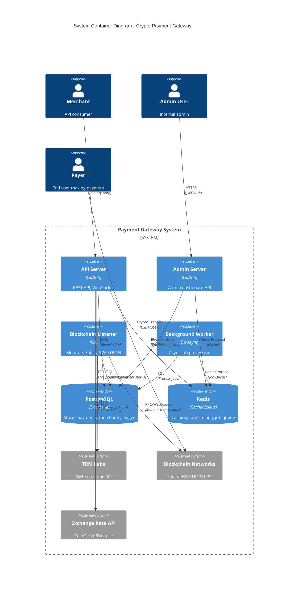
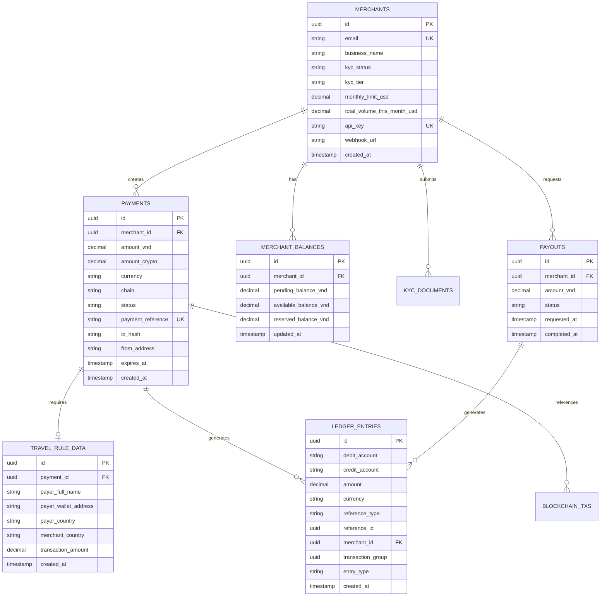
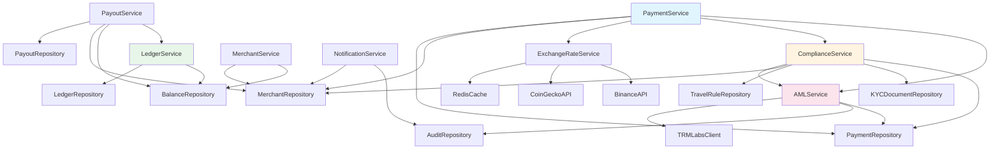

# Architecture Audit - Crypto Payment Gateway

**Generated:** 2025-01-27  
**Version:** 1.0.0  
**Purpose:** Master Documentation of Technical Structure and Business Logic

---

## Table of Contents

1. [System Topology](#1-system-topology)
2. [Data Flow Analysis](#2-data-flow-analysis)
3. [State Machine Documentation](#3-state-machine-documentation)
4. [Infrastructure & Configuration](#4-infrastructure--configuration)
5. [Operational Health Check](#5-operational-health-check)

---

## 1. System Topology

### 1.1 C4 Container Diagram



### 1.2 Database ERD



### 1.3 Service Dependency Map



**Service Descriptions:**

- **PaymentService** (`internal/service/payment.go`): Core payment creation, confirmation, and lifecycle management
- **ComplianceService** (`internal/service/compliance.go`): KYC tier validation, monthly limits, Travel Rule enforcement
- **LedgerService** (`internal/service/ledger.go`): Double-entry accounting for all financial transactions
- **AMLService** (`internal/service/aml.go`): Wallet sanctions screening via TRM Labs
- **ExchangeRateService** (`internal/service/exchange_rate.go`): VND ↔ Crypto rate fetching with Redis caching
- **PayoutService** (`internal/service/payout.go`): Merchant payout request processing
- **MerchantService** (`internal/service/merchant.go`): Merchant account management
- **NotificationService** (`internal/service/notification.go`): Webhook and email notifications

---

## 2. Data Flow Analysis

### 2.1 The "Money In" Flow

**Flow:** Blockchain TX → Listener → Channel/Queue → Payment Service → Ledger Update

**Detailed Steps:**

1. **Blockchain Transaction** (`cmd/listener/main.go:111-132`)
   - User sends USDT/USDC to platform wallet address
   - Transaction includes `payment_reference` in memo field
   - Transaction is broadcast to Solana/BSC/TRON network

2. **Listener Detection** (`internal/blockchain/solana/listener.go:316-380`)
   - Listener polls blockchain via WebSocket/RPC (`PollInterval: 10s`)
   - Detects transaction to platform wallet
   - Extracts: `payment_reference`, `amount`, `from_address`, `tx_hash`
   - Verifies transaction is finalized (Solana) or has required confirmations (BSC: 15, TRON: 19)

3. **Payment Confirmation Callback** (`cmd/listener/main.go:95-419`)
   - Calls `PaymentService.ConfirmPayment()` with transaction details
   - Location: `internal/service/payment.go:447-587`
   - Validates payment exists and is in confirmable state
   - Checks amount matches expected (tolerance: 0.000001 crypto)

4. **AML Post-Screening** (`cmd/listener/main.go:360-414`)
   - After confirmation, screens `from_address` via TRM Labs
   - If sanctioned: logs error, flags for manual review
   - If high-risk (score ≥80): logs warning
   - Records screening result in audit log

5. **Ledger Update** (`internal/service/ledger.go:72-153`)
   - `RecordPaymentReceived()` creates double-entry:
     - **DEBIT:** `crypto_pool` (+X USDT)
     - **CREDIT:** `merchant_pending:{merchant_id}` (+Y VND equivalent)
   - Updates `merchant_balances.pending_balance_vnd`

6. **Status Transition** (`internal/service/payment.go:495-520`)
   - Payment status: `pending` → `confirming` → `completed`
   - Sets `tx_hash`, `from_address`, `confirmed_at`
   - Publishes WebSocket event (if Redis available)

7. **Settlement** (`internal/service/ledger.go:155-249`)
   - `RecordPaymentConfirmed()` moves funds:
     - **DEBIT:** `merchant_pending:{merchant_id}` (-Y VND)
     - **CREDIT:** `merchant_available:{merchant_id}` (+Y * 0.99 VND)
     - **CREDIT:** `fee_revenue` (+Y * 0.01 VND)
   - Fee deduction: 1% (configurable via `FeePercentage`)

**Key Files:**
- `cmd/listener/main.go:95-419` - Confirmation callback with AML
- `internal/service/payment.go:447-587` - Payment confirmation logic
- `internal/service/ledger.go:72-249` - Ledger entries
- `internal/blockchain/solana/listener.go:316-380` - Transaction parsing

### 2.2 The "Compliance" Gate

**Flow:** Payment Creation → AML Check → Travel Rule Verification → DB Insert

**Detailed Steps:**

1. **Payment Creation Request** (`internal/service/payment.go:163-382`)
   - Merchant calls `POST /api/v1/payments`
   - Handler: `internal/api/handler/payment.go:CreatePayment`
   - Validates merchant exists and KYC is approved

2. **AML Pre-Screening** (`internal/service/payment.go:218-252`)
   - **Shift-Left Security:** Screens wallet BEFORE creating payment record
   - If `from_address` provided, calls `AMLService.ValidateTransaction()`
   - Uses TRM Labs API to check sanctions lists
   - **Rejects payment immediately** if wallet is sanctioned
   - Location: `internal/service/aml.go:ScreenWalletAddress`

3. **Wallet Signature Verification** (`internal/service/payment.go:254-303`)
   - If `from_address` provided, requires `signature` + `signed_message`
   - Verifies Ed25519 signature (Solana) using `internal/pkg/web3`
   - Prevents wallet address spoofing for unhosted wallets
   - Standard message: `"Payment {payment_id} for {merchant_id}"`

4. **Monthly Limit Check** (`internal/service/compliance.go:160-201`)
   - Checks `merchant.total_volume_this_month_usd + amount_usd ≤ monthly_limit_usd`
   - Auto-resets monthly volume if new month detected
   - KYC Tier limits:
     - Tier 1: $5,000/month
     - Tier 2: $50,000/month
     - Tier 3: $500,000/month (effectively unlimited)

5. **Travel Rule Validation** (`internal/service/compliance.go:89-158`)
   - If `amount_usd > $1000`: Requires Travel Rule data
   - Validates `TravelRuleData` structure:
     - Payer: `full_name`, `wallet_address`, `country` (ISO 3166-1 alpha-2)
     - Merchant: `full_name`, `country`
   - Stores in `travel_rule_data` table
   - Sets payment status to `pending_compliance` if Travel Rule required but missing

6. **Payment Record Creation** (`internal/service/payment.go:338-381`)
   - Generates UUID payment ID
   - Generates unique `payment_reference` (16 chars)
   - Calculates `amount_crypto` from `amount_vnd` using exchange rate
   - Sets `expires_at` (default: 30 minutes)
   - Calculates fee: `fee_vnd = amount_vnd * fee_percentage`
   - Inserts into `payments` table with status `created`

7. **Compliance Deadline** (`internal/model/payment.go:67-68`)
   - If Travel Rule required: Sets `compliance_deadline` (24 hours from creation)
   - Background job (`internal/jobs/compliance_expiry.go`) expires payments after deadline
   - Status transitions: `pending_compliance` → `failed` (if deadline exceeded)

**Key Files:**
- `internal/service/payment.go:163-382` - Payment creation with compliance
- `internal/service/compliance.go:89-201` - Compliance validation
- `internal/service/aml.go` - AML screening
- `internal/jobs/compliance_expiry.go` - Compliance expiry job

### 2.3 The "Settlement" Flow

**How `merchant_available_balance` is Calculated:**

1. **Initial Payment Confirmation** (`internal/service/ledger.go:155-249`)
   - When payment confirmed, `RecordPaymentConfirmed()` is called
   - Moves funds from `pending` → `available` (minus fee)
   - Updates `merchant_balances.available_balance_vnd` via `ConvertPendingToAvailableTx()`

2. **Fee Deduction** (`internal/service/ledger.go:210-223`)
   - Fee percentage: 1% (default, configurable)
   - Calculation: `fee_vnd = amount_vnd * 0.01`
   - Net amount: `net_amount_vnd = amount_vnd - fee_vnd`
   - Fee recorded as revenue: `CREDIT: fee_revenue (+fee_vnd)`

3. **Balance Calculation** (`internal/repository/balance.go`)
   - `merchant_balances` table stores:
     - `pending_balance_vnd`: Awaiting confirmation
     - `available_balance_vnd`: Available for payout
     - `reserved_balance_vnd`: Reserved for pending payouts
   - Updated via atomic SQL transactions

4. **Payout Processing** (`internal/service/payout.go`)
   - When payout requested: `available` → `reserved`
   - When payout completed: `reserved` → deducted (plus payout fee)
   - Payout fee: Additional fee on top of transaction fee

**Revenue Fee Deduction Location:**
- **Primary:** `internal/service/ledger.go:210-223` - Fee recorded as `fee_revenue` credit
- **Calculation:** `internal/service/payment.go:125-129` - `CalculateFee()` method
- **Database:** `migrations/002_create_payments_table.up.sql:38-40` - `fee_vnd`, `net_amount_vnd` columns

**Key Files:**
- `internal/service/ledger.go:155-249` - Settlement logic
- `internal/repository/balance.go` - Balance updates
- `internal/service/payout.go` - Payout processing

---

## 3. State Machine Documentation

### 3.1 Payment Lifecycle States

**PaymentStatus Enum** (`internal/model/payment.go:10-21`):

```go
PaymentStatusCreated           // Initial state after creation
PaymentStatusPending           // Awaiting blockchain confirmation
PaymentStatusPendingCompliance // Awaiting Travel Rule data (>$1000)
PaymentStatusConfirming       // Transaction detected, confirming
PaymentStatusCompleted         // Successfully confirmed and settled
PaymentStatusExpired           // Expired (timeout or compliance deadline)
PaymentStatusFailed           // Failed (amount mismatch, compliance failure, etc.)
```

### 3.2 Payment State Transition Matrix

| From State | To State | Triggered By | Condition | Code Location |
|------------|----------|--------------|-----------|--------------|
| `created` | `pending` | Payment Service | Payment created successfully | `internal/service/payment.go:347` |
| `created` | `pending_compliance` | Compliance Service | Amount > $1000 USD, Travel Rule required | `internal/service/compliance.go:117-125` |
| `pending` | `confirming` | Blockchain Listener | Transaction detected on blockchain | `internal/service/payment.go:497` |
| `pending_compliance` | `confirming` | Blockchain Listener | Transaction detected + compliance data submitted | `internal/service/payment.go:497` |
| `confirming` | `completed` | Payment Service | Confirmation successful, ledger updated | `internal/service/payment.go:520-587` |
| `created` | `expired` | Background Worker | `expires_at` passed | `internal/worker/server.go:177-188` |
| `pending` | `expired` | Background Worker | `expires_at` passed | `internal/worker/server.go:177-188` |
| `pending_compliance` | `failed` | Compliance Expiry Job | `compliance_deadline` passed (24h) | `internal/jobs/compliance_expiry.go:86-110` |
| `confirming` | `failed` | Payment Service | Amount mismatch or validation error | `internal/service/payment.go:485-493` |
| Any | `failed` | AML Service | Sanctioned wallet detected | `cmd/listener/main.go:384-397` |

**State Validation Methods** (`internal/model/payment.go:87-110`):

- `IsExpired()`: Checks if `expires_at < now()`
- `IsCompleted()`: Returns `status == PaymentStatusCompleted`
- `IsPending()`: Returns `status IN (pending, pending_compliance, confirming)`
- `CanBeConfirmed()`: Returns `status IN (created, pending, pending_compliance) AND !IsExpired()`
- `IsPendingCompliance()`: Returns `status == PaymentStatusPendingCompliance`
- `IsComplianceExpired()`: Checks if `compliance_deadline < now()`

### 3.3 Merchant Status States

**MerchantStatus Enum** (`internal/model/merchant.go:32-39`):

- `MerchantStatusActive`: Can accept payments
- `MerchantStatusSuspended`: Temporarily disabled
- `MerchantStatusClosed`: Permanently closed

**KYCStatus Enum** (`internal/model/merchant.go:11-21`):

- `KYCStatusPending`: Initial state
- `KYCStatusInProgress`: Under review
- `KYCStatusApproved`: Can process payments
- `KYCStatusRejected`: KYC failed
- `KYCStatusSuspended`: Temporarily suspended
- `KYCStatusExpired`: KYC documents expired

**KYC Tier Limits** (`internal/model/merchant.go:158-170`):

- `KYCTier1`: $5,000/month
- `KYCTier2`: $50,000/month
- `KYCTier3`: $500,000/month

---

## 4. Infrastructure & Configuration

### 4.1 Tech Stack Summary

**Go Version:** 1.24.7 (`go.mod:3`)

**Key Dependencies:**

- **Web Framework:** `github.com/gin-gonic/gin v1.11.0` - HTTP router
- **Database:** `github.com/lib/pq v1.10.9` - PostgreSQL driver
- **ORM:** GORM (via database package) - Database abstraction
- **Cache/Queue:** `github.com/redis/go-redis/v9 v9.16.0` - Redis client
- **Job Queue:** `github.com/hibiken/asynq v0.25.1` - Background job processing
- **Blockchain:**
  - Solana: `github.com/gagliardetto/solana-go v1.14.0`
  - BSC/Ethereum: `github.com/ethereum/go-ethereum v1.15.6`
- **Decimal Math:** `github.com/shopspring/decimal v1.4.0` - Precise decimal calculations
- **Logging:** `github.com/sirupsen/logrus v1.9.3` - Structured logging
- **JWT:** `github.com/golang-jwt/jwt/v5 v5.3.0` - Admin authentication
- **UUID:** `github.com/google/uuid v1.6.0` - ID generation

### 4.2 Configuration Analysis

**Configuration Structure** (`internal/config/config.go:14-32`):

**Critical Toggles:**

1. **Environment** (`ENV`):
   - Values: `development`, `staging`, `production`
   - Affects: SSL mode, validation strictness, logging level

2. **AML/Compliance:**
   - `TRM_LABS_API_KEY`: TRM Labs API key for AML screening
   - `TRM_LABS_BASE_URL`: Default: `https://api.trmlabs.com/public/v1`
   - If not set: Uses mock client (development mode)

3. **Security:**
   - `JWT_SECRET`: Required in production (`config.go:309`)
   - `WEBHOOK_SIGNING_KEY`: Required in production (`config.go:312`)
   - `API_RATE_LIMIT`: Default: 100 requests/minute (`config.go:189`)
   - `RATE_LIMIT_PER_MINUTE`: Per-API-key limit (`config.go:260`)

4. **Database:**
   - `DB_SSL_MODE`: Must be enabled in production (`config.go:321`)
   - `DB_MAX_OPEN_CONNS`: Default: 25 (`config.go:206`)
   - `DB_MAX_IDLE_CONNS`: Default: 5 (`config.go:207`)

5. **Blockchain:**
   - `SOLANA_RPC_URL`: Solana RPC endpoint
   - `SOLANA_CONFIRMATION_LEVEL`: `finalized` or `confirmed` (`config.go:79`)
   - `BSC_RPC_URL`: BSC RPC endpoint
   - `TRON_MIN_CONFIRMATIONS`: Default: 19 (`config.go:104`)
   - `TRON_SWEEP_THRESHOLD_USD`: Hot wallet sweep threshold (`config.go:105`)

6. **Exchange Rate:**
   - `EXCHANGE_RATE_CACHE_TTL`: Default: 300 seconds (`config.go:250`)
   - `EXCHANGE_RATE_PRIMARY_API`: CoinGecko (`config.go:248`)
   - `EXCHANGE_RATE_SECONDARY_API`: Binance (`config.go:249`)

7. **Payment:**
   - Fee percentage: Hardcoded to 0.01 (1%) in `PaymentServiceConfig` (`internal/api/server.go:418`)
   - Expiry minutes: Default: 30 (`internal/service/payment.go:44`)

**Configuration Validation** (`internal/config/config.go:304-366`):

- Production mode enforces: JWT_SECRET, WEBHOOK_SIGNING_KEY, DB_SSL_MODE
- Validates required blockchain RPC URLs
- Validates database and Redis connectivity

### 4.3 Background Jobs

**Worker Server** (`cmd/worker/main.go`):

**Job Types** (`internal/worker/server.go:150-172`):

1. **Webhook Delivery** (`TypeWebhookDelivery`)
   - Queue: `webhooks` (Priority: 5)
   - Purpose: Deliver payment status webhooks to merchants
   - Retry: Exponential backoff

2. **Payment Expiry** (`TypePaymentExpiry`)
   - Queue: `periodic` (Priority: 4)
   - Schedule: Every 5 minutes (`*/5 * * * *`)
   - Purpose: Mark expired payments as `expired`
   - Location: `internal/worker/server.go:177-188`

3. **Balance Check** (`TypeBalanceCheck`)
   - Queue: `monitoring` (Priority: 2)
   - Schedule: Every 5 minutes (`*/5 * * * *`)
   - Purpose: Monitor wallet balances and alert if low

4. **Daily Settlement Report** (`TypeDailySettlementReport`)
   - Queue: `reports` (Priority: 1)
   - Schedule: Daily at 8 AM (`0 8 * * *`)
   - Purpose: Generate daily settlement reports

**Additional Jobs** (`internal/jobs/`):

5. **Compliance Expiry Job** (`internal/jobs/compliance_expiry.go`)
   - Schedule: Every 5 minutes (`*/5 * * * *`)
   - Purpose: Expire payments stuck in `pending_compliance` after 24h deadline
   - Updates status: `pending_compliance` → `failed`

6. **OTC Liquidity Monitor** (`internal/jobs/otc_liquidity_monitor.go`)
   - Schedule: Every 15 minutes (`*/15 * * * *`)
   - Purpose: Monitor OTC partner VND liquidity pools
   - Alerts if balance < threshold (default: 50M VND low, 10M VND critical)

**Worker Configuration** (`cmd/worker/main.go:117-125`):

- Concurrency: 10 workers
- Queue Priorities:
  - `webhooks`: 5 (highest)
  - `webhooks_retry`: 3
  - `periodic`: 4
  - `monitoring`: 2
  - `reports`: 1 (lowest)

---

## 5. Operational Health Check

### 5.1 Code Quality

**Error Handling:**

✅ **Structured Errors:**
- Custom error types defined (`internal/service/payment.go:23-40`)
- Errors wrapped with context using `fmt.Errorf("...: %w", err)`
- Repository errors: `ErrPaymentNotFound`, `ErrMerchantNotFound` (`internal/repository/`)

⚠️ **Generic Error Returns:**
- Some functions return generic `error` without specific types
- Example: `internal/service/ledger.go` uses generic errors for validation

**Logging:**

✅ **Structured Logging:**
- Uses `logrus` with structured fields (`logger.Fields`)
- Log levels: `Info`, `Warn`, `Error`, `Fatal`
- Context included: `payment_id`, `merchant_id`, `tx_hash`, etc.

✅ **Audit Trail:**
- `audit_logs` table records all critical actions
- Actor types: `system`, `merchant`, `admin`
- Action categories: `payment`, `payout`, `kyc`, `compliance`

**Code Organization:**

✅ **Layered Architecture:**
- Clear separation: `handler` → `service` → `repository` → `database`
- Models in `internal/model/`
- Business logic in `internal/service/`
- Data access in `internal/repository/`

✅ **Modular Design:**
- New modular structure in `internal/modules/` (payment, payout, merchant, etc.)
- Registry pattern for module initialization (`internal/modules/registry.go`)

### 5.2 Security

**Input Validation:**

✅ **Request Validation:**
- Uses Gin validator (`validate` tags on models)
- Examples: `validate:"required,uuid"`, `validate:"required,gt=0"`
- Location: `internal/model/payment.go`, `internal/model/merchant.go`

✅ **Amount Validation:**
- Positive amount checks (`amount > 0`)
- Fee percentage bounds: `0 <= fee_percentage <= 0.1` (10% max)
- Database constraints: `CHECK (amount_vnd > 0 AND amount_crypto > 0)`

**Authentication:**

✅ **API Key Auth:**
- Middleware: `internal/api/middleware/api_key_auth.go`
- Cached in Redis (TTL: 5 minutes)
- Required for: `/api/v1/payments/*`, `/api/v1/merchant/*`

✅ **JWT Auth:**
- Middleware: `internal/api/middleware/jwt_auth.go`
- Required for: `/api/admin/*`
- Secret: `JWT_SECRET` env var

✅ **Wallet Signature Verification:**
- Ed25519 signature verification for Solana (`internal/pkg/web3`)
- Prevents wallet address spoofing
- Location: `internal/service/payment.go:254-303`

**CORS Configuration:**

✅ **CORS Enabled:**
- Configurable origins via `API_ALLOW_ORIGINS`
- Default: `http://localhost:3000`
- Credentials: `true`
- Max age: 12 hours
- Location: `internal/api/server.go:86-118`

**AML/Sanctions Screening:**

✅ **Pre-Screening:**
- Screens wallet BEFORE creating payment record
- Uses TRM Labs API (or mock in development)
- Rejects sanctioned wallets immediately
- Location: `internal/service/payment.go:218-252`

✅ **Post-Screening:**
- Screens `from_address` after payment confirmation
- Records results in audit log
- Flags high-risk transactions
- Location: `cmd/listener/main.go:360-414`

**Data Encryption:**

⚠️ **Travel Rule Data:**
- Model indicates `encrypt:"true"` tags (`internal/model/travel_rule.go:19-24`)
- **TODO:** Encryption implementation not found in codebase
- Sensitive fields: `payer_id_document`, `payer_date_of_birth`, `payer_address`

### 5.3 Performance

**Caching:**

✅ **Redis Caching:**
- Exchange rates cached (TTL: 5 minutes, configurable)
- API key lookups cached (TTL: 5 minutes)
- Location: `internal/pkg/cache/redis_cache.go`

✅ **Database Indexes:**
- Payments: `merchant_id`, `status`, `tx_hash`, `payment_reference`, `expires_at`
- Merchants: `email`, `api_key`, `kyc_status`, `status`
- Ledger: `merchant_id`, `reference_type`, `reference_id`, `transaction_group`
- Travel Rule: `payment_id`, `payer_country`, `merchant_country`
- Location: Migration files (`migrations/*.sql`)

**Database Optimization:**

✅ **Connection Pooling:**
- Max open connections: 25 (configurable)
- Max idle connections: 5 (configurable)
- Location: `internal/config/config.go:206-207`

✅ **Query Optimization:**
- Composite indexes for common queries
- Example: `idx_payments_merchant_status` on `(merchant_id, status)`
- Soft deletes: `WHERE deleted_at IS NULL` in queries

**Background Processing:**

✅ **Async Job Processing:**
- Uses Asynq for background jobs
- Retry with exponential backoff
- Queue priorities for critical jobs
- Location: `internal/worker/server.go`

**Blockchain Polling:**

✅ **Efficient Polling:**
- Solana: WebSocket for real-time updates
- BSC/TRON: Block-by-block polling (10s interval)
- Deduplication: Tracks processed transactions
- Location: `internal/blockchain/solana/listener.go`, `internal/blockchain/bsc/listener.go`

**Potential Performance Issues:**

⚠️ **N+1 Queries:**
- Some service methods may fetch related data in loops
- Example: `ListPayments()` might fetch merchant for each payment
- **Recommendation:** Use JOIN queries or batch fetching

⚠️ **No Database Query Timeout:**
- Some queries may hang indefinitely
- **Recommendation:** Add context timeouts to all database queries

---

## Appendix: Key File References

### Entry Points
- `cmd/api/main.go` - API server entry point
- `cmd/admin/main.go` - Admin server entry point
- `cmd/listener/main.go` - Blockchain listener entry point
- `cmd/worker/main.go` - Background worker entry point

### Core Services
- `internal/service/payment.go` - Payment lifecycle management
- `internal/service/compliance.go` - Compliance validation
- `internal/service/ledger.go` - Double-entry accounting
- `internal/service/aml.go` - AML screening
- `internal/service/payout.go` - Payout processing

### API Layer
- `internal/api/server.go` - API server setup and routing
- `internal/api/handler/payment.go` - Payment HTTP handlers
- `internal/api/middleware/` - Authentication, rate limiting, CORS

### Blockchain Integration
- `internal/blockchain/solana/listener.go` - Solana transaction listener
- `internal/blockchain/bsc/listener.go` - BSC transaction listener
- `internal/blockchain/tron/` - TRON integration

### Data Models
- `internal/model/payment.go` - Payment model and status enums
- `internal/model/merchant.go` - Merchant model and KYC tiers
- `internal/model/ledger.go` - Ledger entry model
- `internal/model/travel_rule.go` - Travel Rule data model

### Database
- `migrations/` - Database schema migrations
- `internal/repository/` - Data access layer

---

**Document Status:** Complete  
**Last Updated:** 2025-01-27  
**Maintained By:** Architecture Team

