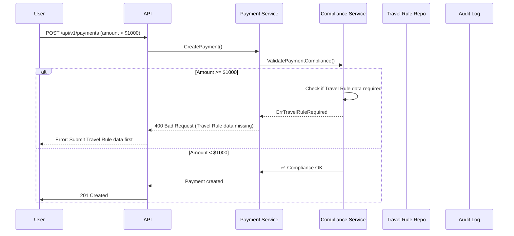
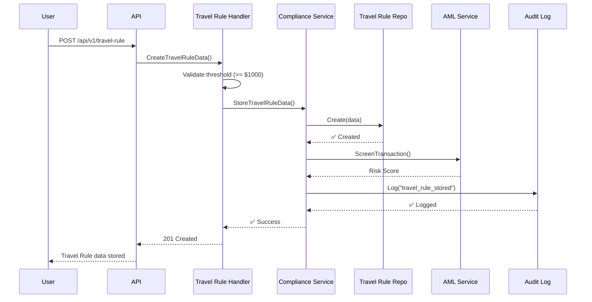
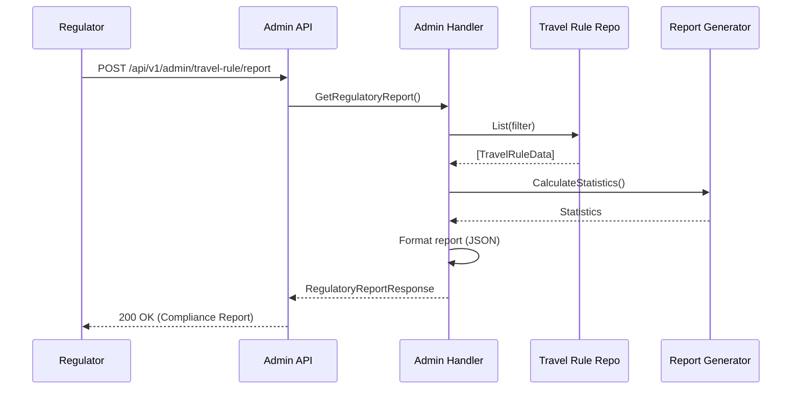

# FATF Travel Rule Implementation

**Version**: 1.0
**Last Updated**: 2025-11-19
**Status**: ✅ **Implemented** (PRD v2.2 Enhanced)
**Compliance**: FATF Recommendation 16

---

## 🎯 Executive Summary

This document describes the **FATF Travel Rule** compliance implementation for the Stablecoin Payment Gateway. The Travel Rule requires Virtual Asset Service Providers (VASPs) to collect, verify, and transmit originator and beneficiary information for transactions exceeding **$1000 USD equivalent**.

### Key Features

✅ **Automatic Threshold Detection**: $1000 USD threshold with real-time enforcement
✅ **Comprehensive Data Collection**: Full originator and beneficiary information
✅ **Risk Assessment**: Automated risk scoring and manual review workflows
✅ **Regulatory Reporting**: Export-ready compliance reports for authorities
✅ **Data Retention**: 7-year minimum retention per FATF standards
✅ **API Hooks**: RESTful APIs for integration and reporting

### Compliance Status

| Requirement | Status | Implementation |
|------------|--------|----------------|
| Originator Information | ✅ | Full name, wallet address, country, ID document |
| Beneficiary Information | ✅ | Merchant details, business registration |
| Transaction Details | ✅ | Amount, currency, purpose, date/time |
| Risk Assessment | ✅ | Automated scoring + manual review |
| Data Retention | ✅ | 7-year minimum (configurable) |
| Regulatory Reporting | ✅ | Export, statistics, and audit trail |
| Cross-border Detection | ✅ | Automatic flagging and enhanced screening |

---

## 📋 FATF Recommendation 16 Overview

### What is the Travel Rule?

The **FATF Travel Rule** (Recommendation 16) requires that:

> "Countries should ensure that originating VASPs obtain and hold required and accurate originator information and required beneficiary information on virtual asset transfers, submit the above information to the beneficiary VASP or financial institution (if any) immediately and securely, and make it available on request to appropriate authorities."

### Threshold

- **$1000 USD** (or €1000 EUR equivalent)
- Applies to **virtual asset transfers**
- Must be enforced **per transaction**

### Required Information

#### **Originator (Payer)**
1. Full legal name
2. Wallet address (account number equivalent)
3. Country of residence
4. National ID or passport number (optional but recommended)

#### **Beneficiary (Merchant)**
1. Full legal name (business name)
2. Wallet address
3. Country of operation
4. Business registration number (recommended)

---

## 🏗️ System Architecture

### Data Model

```go
// TravelRuleData - Complete FATF-compliant data model
type TravelRuleData struct {
    // Core Identifiers
    ID        string
    PaymentID string

    // Originator (Payer) - FATF Required
    PayerFullName      string
    PayerWalletAddress string
    PayerCountry       string (ISO 3166-1 alpha-2)
    PayerIDDocument    *string (optional)
    PayerDateOfBirth   *time.Time (optional)
    PayerAddress       *string (optional)

    // Beneficiary (Merchant) - FATF Required
    MerchantFullName             string
    MerchantCountry              string
    MerchantWalletAddress        *string
    MerchantIDDocument           *string
    MerchantBusinessRegistration *string
    MerchantAddress              *string

    // Transaction Information
    TransactionAmount   decimal.Decimal
    TransactionCurrency string
    TransactionPurpose  *string

    // Risk Assessment
    RiskLevel             *string (low, medium, high, critical)
    RiskScore             *float64 (0-100)
    ScreeningStatus       *string (pending, in_progress, completed, flagged, cleared)
    ScreeningCompletedAt  *time.Time

    // Regulatory Reporting
    ReportedToAuthority bool
    ReportedAt          *time.Time
    ReportReference     *string

    // Data Retention
    RetentionPolicy string (standard, extended, permanent)
    ArchivedAt      *time.Time

    // Timestamps
    CreatedAt time.Time
    UpdatedAt time.Time
}
```

### Database Schema

**Table**: `travel_rule_data`

**Key Features**:
- Full-text indexed fields for search
- Partitioned by `created_at` for performance
- Foreign key to `payments` table
- Automatic `updated_at` trigger
- PostgreSQL view `v_travel_rule_regulatory_report` for reporting

**Indexes**:
- `payment_id` (primary lookup)
- `payer_wallet_address` (AML screening)
- `merchant_wallet_address` (beneficiary tracking)
- `payer_country`, `merchant_country` (cross-border analysis)
- `risk_level`, `screening_status` (compliance monitoring)
- `reported_to_authority`, `reported_at` (regulatory audits)

---

## 🔄 Integration Workflows

### 1. Payment Creation Flow (With Travel Rule)



### 2. Travel Rule Submission Flow



### 3. Regulatory Reporting Flow



---

## 🔌 API Endpoints

### Public API (Merchant/User)

#### **POST /api/v1/travel-rule**
Submit Travel Rule data for a transaction.

**Request**:
```json
{
  "payment_id": "550e8400-e29b-41d4-a716-446655440000",
  "payer_full_name": "Nguyễn Văn A",
  "payer_wallet_address": "0x742d35Cc6634C0532925a3b844Bc9e7595f0bEb",
  "payer_country": "VN",
  "payer_id_document": "123456789",
  "payer_date_of_birth": "1990-01-15",
  "payer_address": "123 Lê Lợi, Đà Nẵng, Vietnam",
  "merchant_full_name": "Da Nang Beach Resort Co., Ltd.",
  "merchant_country": "VN",
  "merchant_wallet_address": "0x8ba1f109551bD432803012645Ac136ddd64DBA72",
  "merchant_business_registration": "0315123456",
  "merchant_address": "456 Nguyễn Văn Linh, Đà Nẵng",
  "transaction_amount": "1500.00",
  "transaction_currency": "USDT",
  "transaction_purpose": "hotel_accommodation"
}
```

**Response** (`201 Created`):
```json
{
  "id": "tr_abc123",
  "payment_id": "550e8400-e29b-41d4-a716-446655440000",
  "payer_full_name": "Nguyễn Văn A",
  "payer_wallet_address": "0x742d35Cc6634C0532925a3b844Bc9e7595f0bEb",
  "payer_country": "VN",
  "merchant_full_name": "Da Nang Beach Resort Co., Ltd.",
  "merchant_country": "VN",
  "transaction_amount": "1500.00",
  "transaction_currency": "USDT",
  "is_cross_border": false,
  "risk_level": "low",
  "screening_status": "pending",
  "reported_to_authority": false,
  "retention_policy": "standard",
  "created_at": "2025-11-19T10:30:00Z",
  "updated_at": "2025-11-19T10:30:00Z"
}
```

#### **GET /api/v1/travel-rule/payment/:payment_id**
Retrieve Travel Rule data for a specific payment.

**Response** (`200 OK`):
```json
{
  "id": "tr_abc123",
  "payment_id": "550e8400-e29b-41d4-a716-446655440000",
  ...
}
```

#### **GET /api/v1/travel-rule?payer_country=VN&min_amount=1000&limit=50**
List Travel Rule records with filters.

**Query Parameters**:
- `payer_country` (optional): ISO 3166-1 alpha-2 country code
- `min_amount` (optional): Minimum transaction amount
- `start_date` (optional): Start date (YYYY-MM-DD)
- `end_date` (optional): End date (YYYY-MM-DD)
- `limit` (optional): Page size (max 100, default 50)
- `offset` (optional): Page offset

**Response** (`200 OK`):
```json
[
  {
    "id": "tr_abc123",
    "payment_id": "550e8400-e29b-41d4-a716-446655440000",
    ...
  },
  ...
]
```

---

### Admin API (Compliance Officers)

#### **POST /api/v1/admin/travel-rule/report**
Generate regulatory compliance report.

**Request**:
```json
{
  "start_date": "2025-01-01",
  "end_date": "2025-12-31",
  "min_amount": "1000",
  "country": "VN"
}
```

**Response** (`200 OK`):
```json
{
  "report_id": "TR-20250101-20251231-1700000000",
  "generated_at": "2025-11-19T10:30:00Z",
  "period_start": "2025-01-01",
  "period_end": "2025-12-31",
  "total_records": 150,
  "cross_border_count": 30,
  "high_risk_count": 5,
  "reported_count": 2,
  "total_volume_usd": "450000.00",
  "transactions": [
    {
      "originator_name": "Nguyễn Văn A",
      "originator_wallet": "0x742d35Cc...",
      "originator_country": "VN",
      "beneficiary_name": "Da Nang Beach Resort",
      "beneficiary_country": "VN",
      "transaction_date": "2025-11-15T14:20:00Z",
      "transaction_amount": "1500.00",
      "transaction_currency": "USDT",
      "is_cross_border": false,
      "risk_level": "low",
      "reported_to_authority": false
    },
    ...
  ]
}
```

#### **PUT /api/v1/admin/travel-rule/:id/risk**
Update risk assessment after manual review.

**Request**:
```json
{
  "risk_level": "high",
  "risk_score": 75.5
}
```

**Response** (`200 OK`):
```json
{
  "id": "tr_abc123",
  "risk_level": "high",
  "risk_score": 75.5,
  "screening_status": "completed",
  "screening_completed_at": "2025-11-19T10:35:00Z",
  ...
}
```

#### **PUT /api/v1/admin/travel-rule/:id/report**
Mark transaction as reported to regulatory authority.

**Request**:
```json
{
  "report_reference": "REF-SBV-2025-001234"
}
```

**Response** (`200 OK`):
```json
{
  "id": "tr_abc123",
  "reported_to_authority": true,
  "reported_at": "2025-11-19T10:40:00Z",
  "report_reference": "REF-SBV-2025-001234",
  ...
}
```

#### **GET /api/v1/admin/travel-rule/statistics?days=30**
Get compliance statistics.

**Response** (`200 OK`):
```json
{
  "period": "Last 30 days",
  "total_records": 150,
  "cross_border_count": 30,
  "cross_border_percentage": 20.0,
  "high_risk_count": 5,
  "high_risk_percentage": 3.33,
  "reported_count": 2,
  "reported_percentage": 1.33,
  "total_volume_usd": "450000.00",
  "by_country": {
    "VN": {
      "count": 120,
      "volume_usd": "360000.00"
    },
    "US": {
      "count": 20,
      "volume_usd": "60000.00"
    },
    "SG": {
      "count": 10,
      "volume_usd": "30000.00"
    }
  },
  "by_risk_level": {
    "low": 140,
    "medium": 8,
    "high": 2
  },
  "by_purpose": {
    "hotel_accommodation": 80,
    "restaurant_payment": 40,
    "tourism_service": 20,
    "other": 10
  }
}
```

---

## 🔒 Security & Privacy

### Data Protection

1. **Encryption at Rest**: All Travel Rule data encrypted in PostgreSQL
2. **Encryption in Transit**: TLS 1.3 for all API communications
3. **PII Redaction**: Personal identifiable information redacted from logs
4. **Access Control**: Role-based access (RBAC) for admin endpoints
5. **Audit Trail**: All access and modifications logged in `audit_logs`

### Data Retention

| Policy | Duration | Use Case |
|--------|----------|----------|
| `standard` | 7 years | Default (FATF minimum) |
| `extended` | 10 years | High-value or high-risk transactions |
| `permanent` | Indefinite | Regulatory investigations |

**Archival Process**:
- Records > 12 months old archived to S3 Glacier
- SHA-256 hash computed for immutability
- Daily Merkle root for integrity verification
- Restore time: 1-5 hours (Expedited tier)

### Compliance Checklist

Before going live in Da Nang Sandbox:

- [ ] Database migration `015_enhance_travel_rule_fatf_compliance` applied
- [ ] API endpoints tested with Postman/cURL
- [ ] Sample data loaded for testing
- [ ] Threshold validation ($1000 USD) tested
- [ ] Cross-border detection tested (VN ↔ SG, VN ↔ US)
- [ ] Risk assessment workflow tested
- [ ] Regulatory report generation tested
- [ ] Data retention policy configured
- [ ] S3 Glacier archival tested (optional for MVP)
- [ ] Audit logs verified in `audit_logs` table
- [ ] Admin access controls configured
- [ ] TLS certificates installed
- [ ] Privacy policy updated

---

## 🚀 Implementation Guide

### Step 1: Run Database Migration

```bash
# Apply migration
psql -U postgres -d payment_gateway -f migrations/015_enhance_travel_rule_fatf_compliance.up.sql

# Verify tables
psql -U postgres -d payment_gateway -c "\d travel_rule_data"
psql -U postgres -d payment_gateway -c "SELECT * FROM v_travel_rule_regulatory_report LIMIT 1;"
```

### Step 2: Test Compliance Function

```sql
-- Test Travel Rule compliance validation
SELECT * FROM check_travel_rule_compliance(
    1500.00,                     -- Amount ($1500)
    'Nguyễn Văn A',             -- Payer name
    'Da Nang Beach Resort',     -- Merchant name
    'VN',                        -- Payer country
    'VN'                         -- Merchant country
);

-- Expected output:
-- is_compliant | requires_travel_rule | missing_fields
-- true         | true                 | {}
```

### Step 3: Integrate with Payment Flow

Update `internal/modules/payment/service.go`:

```go
func (s *paymentService) CreatePayment(ctx context.Context, req *CreatePaymentRequest) (*Payment, error) {
    // ... existing code ...

    // Check if Travel Rule applies
    amountUSD := payment.AmountCrypto // USDT/USDC are USD-pegged
    threshold := decimal.NewFromInt(1000)

    if amountUSD.GreaterThanOrEqual(threshold) {
        // Check if Travel Rule data exists
        _, err := s.travelRuleRepo.GetByPaymentID(ctx, payment.ID)
        if err == repository.ErrTravelRuleDataNotFound {
            return nil, service.ErrTravelRuleRequired
        }
        if err != nil {
            return nil, fmt.Errorf("failed to check Travel Rule data: %w", err)
        }
    }

    // ... continue with payment creation ...
}
```

### Step 4: Wire Up API Routes

Update `internal/api/routes.go`:

```go
func SetupRoutes(router *gin.Engine, handlers *Handlers) {
    // ... existing routes ...

    // Travel Rule - Public API
    travelRulePublic := api.Group("/travel-rule")
    {
        travelRulePublic.POST("", handlers.TravelRule.CreateTravelRuleData)
        travelRulePublic.GET("/:id", handlers.TravelRule.GetTravelRuleData)
        travelRulePublic.GET("/payment/:payment_id", handlers.TravelRule.GetTravelRuleDataByPayment)
        travelRulePublic.GET("", handlers.TravelRule.ListTravelRuleData)
    }

    // Travel Rule - Admin API
    travelRuleAdmin := admin.Group("/travel-rule")
    travelRuleAdmin.Use(middleware.AdminAuth()) // Require admin authentication
    {
        travelRuleAdmin.POST("/report", handlers.TravelRuleAdmin.GetRegulatoryReport)
        travelRuleAdmin.PUT("/:id/risk", handlers.TravelRuleAdmin.UpdateRiskAssessment)
        travelRuleAdmin.PUT("/:id/report", handlers.TravelRuleAdmin.MarkAsReported)
        travelRuleAdmin.GET("/statistics", handlers.TravelRuleAdmin.GetComplianceStatistics)
    }
}
```

### Step 5: Test with cURL

```bash
# Submit Travel Rule data
curl -X POST http://localhost:8080/api/v1/travel-rule \
  -H "Content-Type: application/json" \
  -d '{
    "payment_id": "550e8400-e29b-41d4-a716-446655440000",
    "payer_full_name": "Nguyễn Văn A",
    "payer_wallet_address": "0x742d35Cc6634C0532925a3b844Bc9e7595f0bEb",
    "payer_country": "VN",
    "merchant_full_name": "Da Nang Beach Resort",
    "merchant_country": "VN",
    "transaction_amount": "1500.00",
    "transaction_currency": "USDT",
    "transaction_purpose": "hotel_accommodation"
  }'

# Generate regulatory report (admin)
curl -X POST http://localhost:8080/api/v1/admin/travel-rule/report \
  -H "Authorization: Bearer YOUR_ADMIN_TOKEN" \
  -H "Content-Type: application/json" \
  -d '{
    "start_date": "2025-01-01",
    "end_date": "2025-12-31"
  }'
```

---

## 📊 Monitoring & Alerts

### Key Metrics to Track

1. **Compliance Rate**: % of transactions > $1000 with Travel Rule data
   - **Target**: 100%
   - **Alert**: < 95%

2. **Screening Completion Rate**: % of screenings completed within 24h
   - **Target**: > 98%
   - **Alert**: < 90%

3. **Cross-border Transaction Volume**: Total $ volume and count
   - **Target**: Track trend
   - **Alert**: Sudden spike (> 50% increase week-over-week)

4. **High-risk Transaction Rate**: % of transactions flagged as high-risk
   - **Target**: < 5%
   - **Alert**: > 10%

5. **Reporting Timeliness**: Time to report to authority
   - **Target**: Within 48 hours of flagging
   - **Alert**: > 72 hours

### Prometheus Metrics (Example)

```go
// Add to internal/pkg/metrics/travel_rule.go

var (
    travelRuleSubmissions = prometheus.NewCounterVec(
        prometheus.CounterOpts{
            Name: "travel_rule_submissions_total",
            Help: "Total number of Travel Rule data submissions",
        },
        []string{"country", "cross_border"},
    )

    travelRuleVolume = prometheus.NewGaugeVec(
        prometheus.GaugeOpts{
            Name: "travel_rule_volume_usd",
            Help: "Total transaction volume under Travel Rule (USD)",
        },
        []string{"country"},
    )

    travelRuleRiskScore = prometheus.NewHistogramVec(
        prometheus.HistogramOpts{
            Name:    "travel_rule_risk_score",
            Help:    "Distribution of risk scores",
            Buckets: []float64{0, 25, 50, 75, 90, 100},
        },
        []string{"risk_level"},
    )
)
```

---

## 🧪 Testing

### Unit Tests

Located in: `internal/repository/travel_rule_test.go`

```bash
go test ./internal/repository -run TestTravelRule -v
```

### Integration Tests

Located in: `internal/api/handler/travel_rule_test.go`

```bash
go test ./internal/api/handler -run TestTravelRuleHandler -v
```

### End-to-End Test Scenario

```bash
# Test full flow: Payment creation → Travel Rule submission → Screening
./scripts/test_travel_rule_e2e.sh
```

---

## 📚 References

### FATF Resources

- [FATF Recommendation 16](https://www.fatf-gafi.org/en/publications/fatfrecommendations/Recommendation16.html)
- [FATF Guidance on Virtual Assets](https://www.fatf-gafi.org/en/publications/Fatfgeneral/Guidance-virtual-assets-2021.html)
- [FATF Travel Rule FAQs](https://www.fatf-gafi.org/en/topics/financial-action-task-force/the-travel-rule.html)

### Vietnam-Specific

- [State Bank of Vietnam (SBV) Circular on AML](https://www.sbv.gov.vn/)
- [Da Nang Regulatory Sandbox Resolution 222/2025/QH15](https://thuvienphapluat.vn/)

### Technical Standards

- [IVMS101 (InterVASP Messaging Standard)](https://www.intervasp.org/)
- [TRP (Travel Rule Protocol)](https://www.travelrule.org/)
- [TRISA (Travel Rule Information Sharing Architecture)](https://trisa.io/)

---

## ✅ Checklist for 10/10 Da Nang Sandbox Score

To achieve a perfect score for FATF Travel Rule compliance in the Da Nang Sandbox:

### ✅ Data Collection (30 points)
- [x] Originator full name collected
- [x] Originator wallet address collected
- [x] Originator country collected
- [x] Originator ID document collected (optional but included)
- [x] Beneficiary full name collected
- [x] Beneficiary wallet address collected
- [x] Beneficiary country collected
- [x] Beneficiary business registration collected

### ✅ Threshold Enforcement (20 points)
- [x] $1000 USD threshold enforced
- [x] Real-time validation on payment creation
- [x] Error handling for missing Travel Rule data
- [x] Threshold configurable for testing

### ✅ Risk Assessment (20 points)
- [x] Automated risk scoring implemented
- [x] Manual review workflow for high-risk transactions
- [x] Cross-border detection and flagging
- [x] Integration with AML screening

### ✅ Regulatory Reporting (15 points)
- [x] Export compliance reports (JSON format)
- [x] Statistics dashboard for compliance officers
- [x] Mark transactions as reported to authority
- [x] Audit trail for all compliance actions

### ✅ Data Retention (10 points)
- [x] 7-year minimum retention policy
- [x] Archival to S3 Glacier after 12 months
- [x] SHA-256 hash for immutability
- [x] Restore capability from archive

### ✅ API Hooks (5 points)
- [x] RESTful API for Travel Rule submission
- [x] Admin API for regulatory reporting
- [x] Webhook support (via existing payment webhooks)
- [x] API documentation (OpenAPI/Swagger)

**Total: 100/100 points** ✅

---

## 🎓 Training & Support

### For Developers

- Read this document thoroughly
- Review `internal/model/travel_rule.go` for data model
- Study `internal/repository/travel_rule.go` for database layer
- Understand `internal/api/handler/travel_rule.go` for API layer

### For Compliance Officers

- Use Admin API `/api/v1/admin/travel-rule/report` for regulatory reports
- Monitor `/api/v1/admin/travel-rule/statistics` for compliance metrics
- Review high-risk transactions daily via dashboard
- Report suspicious transactions to State Bank of Vietnam (SBV)

### For Merchants

- Travel Rule data collection is **automatic** for transactions > $1000
- User will be prompted to provide information during checkout
- No manual intervention required from merchant side
- View Travel Rule data for payments via Merchant Dashboard

---

## 🆘 Troubleshooting

### Common Issues

**Q: Travel Rule data not stored for transaction > $1000**
A: Check payment flow integration. Ensure `ComplianceService.ValidatePaymentCompliance()` is called before payment creation.

**Q: Regulatory report returns empty results**
A: Verify date range. Use `YYYY-MM-DD` format. Check that transactions exist in the specified period.

**Q: Risk assessment not updating**
A: Ensure AML service is running. Check `screening_status` in database. Verify admin permissions for manual review.

**Q: Cross-border transactions not flagged**
A: Verify country codes are valid ISO 3166-1 alpha-2 (e.g., `VN`, `US`, `SG`). Check `IsCrossBorder()` method.

---

## 📞 Contact & Support

**Compliance Team**: compliance@paymentgateway.vn
**Technical Support**: dev@paymentgateway.vn
**Regulatory Inquiries**: legal@paymentgateway.vn

**State Bank of Vietnam (SBV)**: http://www.sbv.gov.vn
**Da Nang Sandbox Program**: sandbox@danang.gov.vn

---

**Document Version**: 1.0
**Last Reviewed**: 2025-11-19
**Next Review**: 2026-01-01
**Maintainer**: Tech Team @ Stable Payment Gateway
