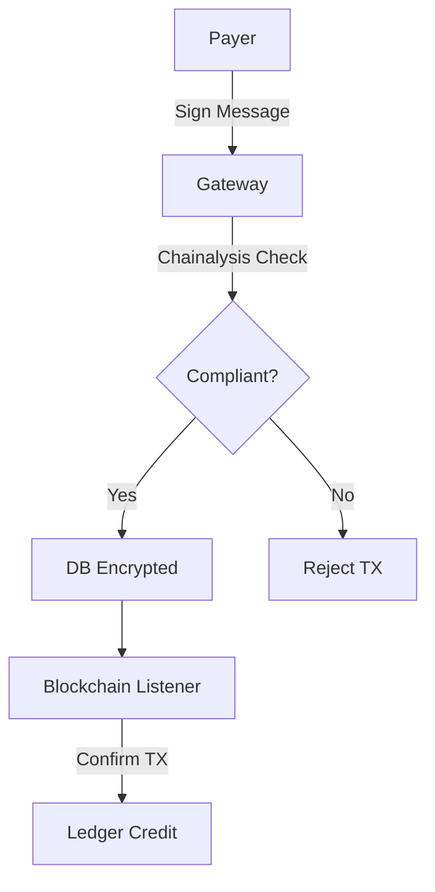

# StableGate

> *The Invisible & Compliant Crypto Gateway for Modern Merchants.*


## Introduction

**StableGate** is a non-custodial crypto payment gateway designed for the enterprise. We bridge the gap between decentralized finance and regulatory requirements by offering a "Stealth Mode" payment experience that is fully compliant with global standards. Unlike traditional gateways that impose cumbersome checks on users, StableGate operates invisibly in the background, ensuring seamless transactions while maintaining strict adherence to financial regulations.

Our core innovation solves the "Travel Rule" dilemma without sacrificing User Experience (UX). By integrating advanced compliance checks directly into the transaction flow—before funds even move—we protect merchants from illicit funds while allowing legitimate customers to pay instantly. StableGate empowers businesses to accept crypto with confidence, knowing that every transaction is vetted, verified, and secure.

## Key Features

*   **🛡️ Shift-Left Security**: We perform AML and Sanctions screening (via Chainalysis) *before* transaction generation, preventing interaction with high-risk wallets entirely.
*   **✍️ Cryptographic Verification**: Utilizing "Wallet Signature" (Ed25519) to verify ownership, we eliminate the need for intrusive deposit tests, creating a zero-friction payment flow.
*   **📒 Double-Entry Ledger**: Built with bank-grade financial accuracy, our internal ledger ensures every cent is accounted for with immutable precision.
*   **⚡ Automated Reconciliation**: Daily solvency checks and automated reconciliation processes guarantee that your books are always balanced and up-to-date.

## Architecture



## Getting Started

Follow these steps to deploy StableGate in your local environment.

### Prerequisites

*   **Docker** & **Docker Compose**
*   **Go** (v1.24+)
*   **Node.js** (for frontend components)

### Installation Steps

1.  **Clone the Repository**
    ```bash
    git clone https://github.com/your-org/stablegate.git
    cd stablegate
    ```

2.  **Configure Environment**
    Copy the example configuration and set your keys. **Crucially**, you must set the `ENCRYPTION_MASTER_KEY` for PII protection.
    ```bash
    cp .env.example .env
    # Edit .env and set ENCRYPTION_MASTER_KEY
    ```

3.  **Run the Application**
    Start the services using Docker Compose.
    ```bash
    docker-compose up -d
    ```

4.  **Access Documentation**
    Once running, the Swagger API documentation is available at:
    `http://localhost:8080/swagger/index.html`

## Tech Stack & Security

**StableGate** is built on a robust, modern technology stack designed for performance and security:

*   **Language**: Golang 1.24 (Gin Framework)
*   **Database**: PostgreSQL
*   **Caching**: Redis
*   **Frontend**: Next.js
*   **Blockchain**: Solana
*   **Infrastructure**: Docker

### Security

Security is not an afterthought; it is the foundation of StableGate.

*   **AES-256-GCM for Data at Rest**: All Personally Identifiable Information (PII) is encrypted using industry-standard AES-256-GCM before being stored in the database.
*   **Ed25519 for Identity Proof**: We leverage Ed25519 cryptographic signatures to cryptographically prove wallet ownership, ensuring that the payer is the legitimate owner of the funds.
*   **Rate Limiting & Webhook Retries**: Our system is hardened against abuse with aggressive rate limiting and includes robust webhook retry mechanisms to ensure reliable data delivery.

## License

Distributed under the **MIT License**. See `LICENSE` for more information.

---

*Built with ❤️ for the Decentralized Economy.*
