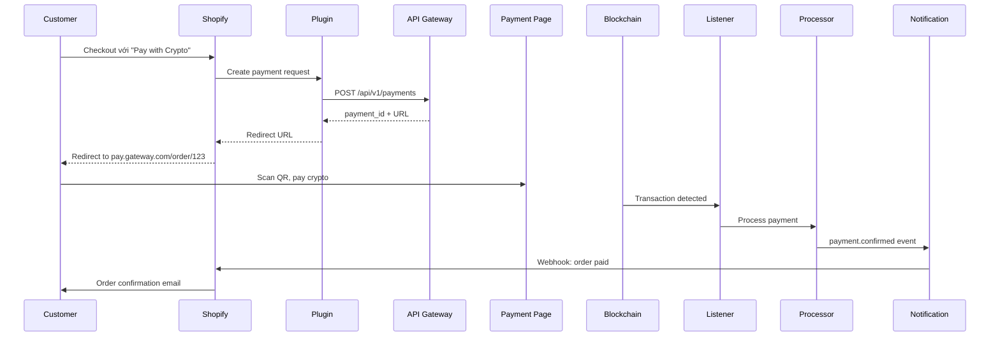

# Requirements: v2.0 Pillar 1 - Hệ sinh thái (SDKs & Plugins)

**Phase**: v2.0 Quarter 1-2
**Timeline**: 8-12 weeks after MVP v1.1 launch
**Status**: 🟢 Product-Led Growth Strategy

---

## 🎯 Mục tiêu Phase

**Trụ cột 1** là chiến lược **Product-Led Growth (PLG)** để giải quyết bài toán **Thu hút khách hàng** (Acquisition) với CAC (Customer Acquisition Cost) ≈ 0.

### Strategic Shift
- **FROM**: Sales-Led Growth (tốn kém, chậm chạp, cần thuyết phục từng dev team)
- **TO**: Product-Led Growth (plugin tự bán chính nó trên app stores)

### Target Platforms
1. **Global**: Shopify, WooCommerce (>500M stores worldwide)
2. **Vietnam**: Haravan, Sapo (>100K Vietnamese merchants)

### Value Proposition
"Shopify Payments + Escrow" - Giải pháp không thể thiếu cho freelancer và merchants bán dịch vụ/sản phẩm rủi ro cao.

---

## 📦 Epic 1: Shopify Plugin

### 🎯 Business Context
- **Market Size**: Shopify có >4M merchants worldwide, ~50K tại Vietnam
- **Opportunity**: Shopify vừa tích hợp USDC native (Coinbase + Stripe partnership)
  - ✅ Good news: Họ đã "giáo dục" merchants rằng stablecoin là hợp pháp
  - ✅ Mở cơ hội: Customers đã sẵn sàng thanh toán bằng stablecoin
- **Differentiation**: Plugin của chúng ta cung cấp:
  - Multi-chain support (USDT trên TRON, USDC trên Solana - phổ biến ở Châu Á)
  - Phí cạnh tranh hơn
  - **Tích hợp Escrow** (Pillar 3) - Shopify Payments không có

---

### Feature 1.1: Shopify App Development

**Priority**: 🔴 P0 (Core)

#### User Stories

**Story 1.1.1**: Shopify App Setup & Authentication
```
As a: Shopify Merchant
I want to: Cài đặt "CryptoGateway" app từ Shopify App Store
So that: Bắt đầu chấp nhận crypto payments
```

**Acceptance Criteria**:
- [ ] Shopify App created trên Shopify Partners Dashboard
- [ ] OAuth flow:
  - Merchant clicks "Install App" trên Shopify App Store
  - Redirect to OAuth consent screen
  - After approval → receive `access_token`
  - Store `shop_domain` + `access_token` trong database
- [ ] Bảng `shopify_integrations`:
  - `id`, `merchant_id`, `shop_domain`, `access_token_encrypted`, `scopes`, `installed_at`
- [ ] Auto-create Merchant account nếu chưa có (từ Shopify shop data)

**Tech Stack**:
- Language: Node.js/TypeScript (Shopify có SDK tốt cho Node)
- Framework: Remix (Shopify recommended framework)
- Shopify SDK: `@shopify/shopify-api`
- Hosting: Vercel hoặc Shopify-specific hosting

**Shopify API Scopes Required**:
```
read_orders, write_orders,
read_products,
write_payment_gateways,
read_customers (for travel rule data collection)
```

---

**Story 1.1.2**: Payment Gateway Integration (Checkout Extension)
```
As a: Shopify Merchant
I want to: Hiển thị "Pay with Crypto" option trong checkout page
So that: Customers có thể chọn thanh toán bằng USDT/USDC
```

**Acceptance Criteria**:
- [ ] Implement Shopify Payments App Extension
- [ ] Checkout UI: "Pay with Crypto (USDT/USDC)" option
- [ ] Khi customer chọn:
  - Call API Gateway (TDD 4.1): `POST /api/v1/payments`
  - Receive `payment_id` + payment URL
  - Redirect customer to Payment Status Page (TDD 5.1): `pay.gateway.com/order/{payment_id}`
- [ ] Webhook từ hệ thống về Shopify khi payment completed:
  - Update order status: `pending` → `paid`
  - Mark order as "fulfilled" (optional, tùy merchant config)

**Shopify Checkout Flow**:


---

**Story 1.1.3**: One-Click Onboarding Flow
```
As a: Shopify Merchant
I want to: Hoàn tất onboarding trong < 5 phút
So that: Bắt đầu nhận thanh toán nhanh chóng
```

**Onboarding Steps**:
1. Install app từ Shopify App Store
2. OAuth approval
3. Plugin auto-redirects đến Merchant Dashboard (TDD 4.3)
4. Merchant thực hiện KYC (Tier 1: chỉ cần email + phone)
5. Auto-approved (hoặc trong vài phút nếu manual review)
6. Merchant được access "Developer" tab trong Dashboard
7. Plugin tự động tạo và lưu API Key + Webhook Secret vào Shopify app settings
8. ✅ Done - "Pay with Crypto" option tự động xuất hiện ở checkout

**Acceptance Criteria**:
- [ ] Toàn bộ flow không cần developer can thiệp
- [ ] Auto-register webhook endpoint: `https://merchant-store.myshopify.com/webhook/crypto-payment`
- [ ] Plugin tự test webhook bằng cách gửi một `ping` event

---

### Feature 1.2: Shopify Webhook Handling (Backend)

**Priority**: 🔴 P0 (Core)

#### User Stories

**Story 1.2.1**: Auto Webhook Registration
```
As a: System
I want to: Tự động đăng ký webhook endpoint khi merchant install app
So that: Có thể update order status khi payment completed
```

**Acceptance Criteria**:
- [ ] Khi merchant clicks "Save" trong app settings:
  - Plugin gọi API Gateway: `POST /api/v1/webhooks`
  - Body:
    ```json
    {
      "merchant_id": "uuid",
      "url": "https://store.myshopify.com/apps/cryptogateway/webhook",
      "events": ["payment.confirmed", "payment.failed"]
    }
    ```
  - API Gateway lưu vào bảng `webhook_endpoints` (TDD 4.2)
- [ ] Notification Service (TDD 4.2) gửi webhook khi `payment.confirmed`:
  - POST request đến `https://store.myshopify.com/apps/cryptogateway/webhook`
  - Plugin nhận webhook → call Shopify API để update order

**Security**:
- [ ] HMAC signature verification (sử dụng Webhook Secret)
- [ ] Retry logic với exponential backoff (3 retries: 2s, 4s, 8s)

---

**Story 1.2.2**: Order Status Sync
```
As a: System
I want to: Tự động update Shopify order status khi crypto payment confirmed
So that: Merchant không cần thao tác thủ công
```

**Shopify API Call**:
```typescript
// apps/shopify-plugin/app/webhooks/payment-confirmed.ts
import { shopify } from '@shopify/shopify-api';

export async function handlePaymentConfirmed(webhook: PaymentConfirmedWebhook) {
  const { order_id, payment_id, amount_vnd, tx_hash } = webhook;

  // Get Shopify access token from database
  const integration = await db.shopifyIntegrations.findOne({
    where: { merchant_id: webhook.merchant_id }
  });

  const client = new shopify.clients.Rest({
    session: {
      shop: integration.shop_domain,
      accessToken: integration.access_token
    }
  });

  // Update order
  await client.put({
    path: `orders/${order_id}`,
    data: {
      order: {
        note: `Crypto payment confirmed. Tx Hash: ${tx_hash}`,
        financial_status: 'paid',
        tags: 'crypto-payment'
      }
    }
  });

  // Optionally: Create transaction record
  await client.post({
    path: `orders/${order_id}/transactions`,
    data: {
      transaction: {
        kind: 'capture',
        amount: amount_vnd / 23000, // Convert to USD for Shopify
        gateway: 'CryptoGateway',
        source_name: 'CryptoGateway'
      }
    }
  });
}
```

---

### Feature 1.3: Shopify App Store Listing

**Priority**: 🟡 P1 (High)

#### User Stories

**Story 1.3.1**: Publish App to Shopify App Store
```
As a: Product Team
I want to: Publish app lên Shopify App Store
So that: Merchants có thể tìm thấy và cài đặt
```

**App Store Requirements**:
- [ ] App name: "CryptoGateway - Accept USDT/USDC Payments"
- [ ] Short description (80 chars): "Accept crypto payments from global customers. USDT/USDC on Solana & BSC."
- [ ] Long description:
  - Highlight cross-border use case
  - Multi-chain support
  - Low fees (1% vs Shopify Payments 2.9%)
  - **Future: Escrow protection for freelancers**
- [ ] Screenshots: 5 high-quality images (checkout, dashboard, payment page)
- [ ] Demo video: 60s showing full flow
- [ ] Privacy policy & Terms of Service
- [ ] Support email: support@cryptogateway.com
- [ ] Pricing:
  - **FREE to install**
  - Transaction fees: 1% (charged when payment confirmed)

**Shopify App Review Process**:
- [ ] Submit app for review (expect 1-2 weeks review time)
- [ ] Address any feedback from Shopify review team
- [ ] Launch publicly

---

## 📦 Epic 2: WooCommerce Plugin

### 🎯 Business Context
- **Market Size**: WooCommerce powers 28% of all online stores (~6M stores worldwide)
- **Vietnam Market**: Nhiều SMEs Việt Nam sử dụng WordPress + WooCommerce
- **Advantage**: Open-source, dễ customize hơn Shopify

---

### Feature 2.1: WooCommerce Plugin Development

**Priority**: 🔴 P0 (Core)

#### User Stories

**Story 2.1.1**: WordPress Plugin Package
```
As a: WooCommerce Merchant
I want to: Tìm và install "CryptoGateway" plugin từ WordPress Plugin Directory
So that: Thêm crypto payment gateway vào store
```

**Acceptance Criteria**:
- [ ] WordPress plugin structure:
  - `crypto-gateway/`
    - `crypto-gateway.php` (main plugin file)
    - `includes/` (payment gateway class)
    - `admin/` (settings page)
    - `assets/` (CSS, JS)
    - `languages/` (i18n: en_US, vi_VN)
- [ ] Plugin header:
  ```php
  /**
   * Plugin Name: CryptoGateway Payment Gateway
   * Description: Accept USDT/USDC crypto payments
   * Version: 1.0.0
   * Requires at least: 5.8
   * Requires PHP: 7.4
   * WC requires at least: 5.0
   * WC tested up to: 8.0
   */
  ```
- [ ] Implement `WC_Payment_Gateway` class:
  ```php
  class WC_Gateway_CryptoGateway extends WC_Payment_Gateway {
      public function __construct() {
          $this->id = 'cryptogateway';
          $this->method_title = 'CryptoGateway';
          $this->method_description = 'Accept USDT/USDC payments';
          $this->has_fields = false;

          $this->init_form_fields();
          $this->init_settings();

          add_action('woocommerce_update_options_payment_gateways_' . $this->id,
                     array($this, 'process_admin_options'));
          add_action('woocommerce_api_cryptogateway_webhook',
                     array($this, 'handle_webhook'));
      }

      public function process_payment($order_id) {
          // Call API Gateway to create payment
          // Redirect to payment URL
      }
  }
  ```

---

**Story 2.1.2**: Plugin Settings Page
```
As a: WooCommerce Merchant
I want to: Nhập API Key và Webhook Secret vào plugin settings
So that: Kết nối store với CryptoGateway backend
```

**Settings Fields**:
- [ ] API Key (text, required)
- [ ] Webhook Secret (password, required)
- [ ] Supported Currencies: Checkbox (USDT-Solana, USDC-Solana, USDT-BSC, USDC-BSC)
- [ ] Test Mode: Yes/No (sử dụng testnet RPC)
- [ ] "Get API Key" button → redirect to Dashboard (TDD 4.3)

**Form Fields Implementation**:
```php
public function init_form_fields() {
    $this->form_fields = array(
        'enabled' => array(
            'title'   => 'Enable/Disable',
            'type'    => 'checkbox',
            'label'   => 'Enable CryptoGateway',
            'default' => 'no'
        ),
        'api_key' => array(
            'title'    => 'API Key',
            'type'     => 'text',
            'desc_tip' => 'Get your API key from CryptoGateway Dashboard'
        ),
        'webhook_secret' => array(
            'title' => 'Webhook Secret',
            'type'  => 'password'
        )
    );
}
```

---

**Story 2.1.3**: Checkout Integration
```
As a: Customer
I want to: Chọn "Pay with Crypto" tại WooCommerce checkout
So that: Thanh toán đơn hàng bằng USDT/USDC
```

**Checkout Flow**:
1. Customer chọn "CryptoGateway" payment method
2. Click "Place Order"
3. Plugin calls: `POST /api/v1/payments` với:
   ```php
   $payload = [
       'merchant_id' => $this->get_merchant_id(),
       'amount_vnd' => $order->get_total(),
       'currency' => 'USDT', // From settings
       'chain' => 'solana',
       'metadata' => [
           'order_id' => $order->get_id(),
           'order_number' => $order->get_order_number(),
           'customer_email' => $order->get_billing_email()
       ]
   ];
   ```
4. Receive `payment_id` + `payment_url`
5. Update order:
   - Status: `pending-payment`
   - Add order note: "Awaiting crypto payment. Payment ID: {payment_id}"
6. Redirect customer to `payment_url`

---

**Story 2.1.4**: Webhook Handler
```
As a: System
I want to: Nhận webhook từ CryptoGateway khi payment confirmed
So that: Tự động update WooCommerce order status
```

**Webhook Endpoint**: `https://store.com/?wc-api=cryptogateway_webhook`

**Handler Logic**:
```php
public function handle_webhook() {
    $payload = file_get_contents('php://input');
    $signature = $_SERVER['HTTP_X_CRYPTOGATEWAY_SIGNATURE'];

    // Verify HMAC signature
    $expected_signature = hash_hmac('sha256', $payload, $this->webhook_secret);
    if (!hash_equals($signature, $expected_signature)) {
        http_response_code(403);
        exit('Invalid signature');
    }

    $data = json_decode($payload, true);

    if ($data['event'] === 'payment.confirmed') {
        $order_id = $data['metadata']['order_id'];
        $order = wc_get_order($order_id);

        $order->payment_complete($data['tx_hash']);
        $order->add_order_note(
            sprintf('Crypto payment received. Tx Hash: %s', $data['tx_hash'])
        );
    }

    http_response_code(200);
    exit('OK');
}
```

---

### Feature 2.2: WordPress Plugin Directory Listing

**Priority**: 🟡 P1 (High)

#### Submission Requirements
- [ ] Plugin uploaded to WordPress SVN repository
- [ ] README.txt với format chuẩn:
  - Description
  - Installation steps
  - FAQ
  - Screenshots
  - Changelog
- [ ] Plugin review: expect 2-4 weeks
- [ ] Once approved: Auto-update cho users

**README.txt Structure**:
```
=== CryptoGateway Payment Gateway ===
Contributors: cryptogateway
Tags: payment gateway, crypto, usdt, usdc, woocommerce
Requires at least: 5.8
Tested up to: 6.4
Requires PHP: 7.4
Stable tag: 1.0.0
License: GPLv2

Accept USDT/USDC crypto payments from global customers.

== Description ==
CryptoGateway allows your WooCommerce store to accept stablecoin payments...
```

---

## 📦 Epic 3: Haravan Plugin (Vietnam Market)

### 🎯 Business Context
- **Market Size**: Haravan có ~30K merchants tại Vietnam
- **Positioning**: "Cổng thanh toán Xuyên biên giới" (KHÔNG phải nội địa)
- **Legal Argument**: "Giúp merchants Haravan nhận tiền từ khách hàng quốc tế"

---

### Feature 3.1: Haravan App Development

**Priority**: 🟡 P1 (High - Vietnam market focus)

#### User Stories

**Story 3.1.1**: Haravan App Marketplace Listing
```
As a: Haravan Merchant
I want to: Tìm "CryptoGateway" trong Haravan App Market
So that: Nhận thanh toán crypto từ khách hàng quốc tế
```

**Haravan App Submission**:
- [ ] Register developer account tại https://partners.haravan.com
- [ ] Create app với OAuth flow (tương tự Shopify)
- [ ] API scopes:
  - `read_orders`, `write_orders`
  - `read_products`
  - `write_payment_gateways`
- [ ] App listing:
  - Name: "CryptoGateway - Thanh toán Crypto Quốc tế"
  - Description (Vietnamese):
    - "Nhận thanh toán USDT/USDC từ khách hàng nước ngoài"
    - "Hỗ trợ Freelancer, Dropshipping, Dịch vụ kỹ thuật số"
    - "Phí thấp 1%, không phí ẩn"
    - **Nhấn mạnh: CHỈ cho giao dịch xuyên biên giới, không phải nội địa**

---

**Story 3.1.2**: Integration với Haravan Checkout
```
As a: System
I want to: Tích hợp payment gateway vào Haravan checkout
So that: Hiển thị "Thanh toán Crypto" option
```

**Technical Notes**:
- Haravan API rất giống Shopify (forked từ Shopify)
- Reuse logic từ Shopify plugin, chỉ cần adjust endpoint URLs

---

## 📦 Epic 4: Sapo Plugin (Vietnam Market)

### 🎯 Business Context
- **Market Size**: Sapo có ~50K merchants tại Vietnam
- **Differentiation**: Sapo tích hợp sâu với các payment gateways nội địa (VNPAY, MoMo)
- **Blue Ocean**: Chưa có crypto payment gateway nào được tích hợp chính thức

---

### Feature 4.1: Sapo App Development

**Priority**: 🟡 P1 (High - Vietnam market)

#### User Stories

**Story 4.1.1**: Sapo App Marketplace Listing
```
As a: Sapo Merchant
I want to: Cài đặt app "CryptoGateway" từ Kho ứng dụng Sapo
So that: Nhận thanh toán quốc tế bằng USDT/USDC
```

**Sapo Platform Research**:
- [ ] Đăng ký Sapo Partner account
- [ ] Tìm hiểu Sapo API documentation (có thể giống Haravan)
- [ ] Submit app lên Sapo App Store
- [ ] Định vị: "Cổng thanh toán Xuyên biên giới độc quyền"

---

## 📦 Epic 5: Backend Support (API Gateway Enhancements)

### Feature 5.1: Plugin Management APIs

**Priority**: 🔴 P0 (Core)

#### User Stories

**Story 5.1.1**: API Key Management API
```
As a: Merchant Dashboard
I want to: Cung cấp API để tạo/xóa API keys
So that: Merchant có thể self-serve khi cài plugin
```

**API Endpoints**:
```
POST   /api/v1/merchants/{id}/api-keys
GET    /api/v1/merchants/{id}/api-keys
DELETE /api/v1/merchants/{id}/api-keys/{key_id}
```

**Response**:
```json
{
  "id": "uuid",
  "name": "Shopify Store - Production",
  "key": "cgw_live_abc123...", // Only shown once
  "key_prefix": "cgw_live_abc", // For display
  "created_at": "2025-11-18T10:00:00Z",
  "last_used_at": null
}
```

---

**Story 5.1.2**: Webhook Management API
```
As a: Plugin
I want to: Tự động đăng ký webhook endpoint
So that: Nhận thông báo khi payment confirmed
```

**API Endpoints**:
```
POST   /api/v1/webhooks
GET    /api/v1/webhooks
PUT    /api/v1/webhooks/{id}
DELETE /api/v1/webhooks/{id}
POST   /api/v1/webhooks/{id}/test (send ping event)
```

**Webhook Events**:
- `payment.created`
- `payment.confirmed`
- `payment.failed`
- `payment.expired`

---

### Feature 5.2: Metadata Support in Payments

**Priority**: 🟡 P1 (High)

#### User Stories

**Story 5.2.1**: Store Plugin-Specific Metadata
```
As a: Plugin
I want to: Lưu metadata (order_id, platform, customer_email) vào payment
So that: Có thể map payment về đúng order khi nhận webhook
```

**Database Schema**:
```sql
ALTER TABLE payments
ADD COLUMN metadata JSONB DEFAULT '{}';

CREATE INDEX idx_payments_metadata ON payments USING GIN (metadata);
```

**Example Metadata**:
```json
{
  "platform": "shopify",
  "shop_domain": "mystore.myshopify.com",
  "order_id": "12345",
  "order_number": "#1001",
  "customer_email": "customer@example.com",
  "customer_name": "John Doe"
}
```

**Query API**:
```
GET /api/v1/payments?metadata.order_id=12345
```

---

## 🧪 Testing Requirements

### Unit Tests
- [ ] Shopify OAuth flow
- [ ] WooCommerce webhook signature verification
- [ ] Haravan/Sapo integration logic

### Integration Tests
- [ ] Full flow: Install plugin → Create payment → Webhook → Order updated
- [ ] Shopify: Mock Shopify API calls
- [ ] WooCommerce: Use WooCommerce test environment

### E2E Tests
- [ ] Shopify: Deploy to staging Shopify store → Test full checkout
- [ ] WooCommerce: Deploy to test WordPress site → Test checkout

---

## 📊 Success Metrics

- [ ] **Plugin Installs**: 100+ installs trong 3 tháng đầu (across all platforms)
- [ ] **Activation Rate**: 60% merchants hoàn thành onboarding
- [ ] **Transaction Volume**: $50K+ qua plugins trong tháng đầu
- [ ] **App Store Ratings**: 4.5+ stars (Shopify, WordPress)
- [ ] **Support Tickets**: < 5% install rate (high quality = low support burden)

---

## 🚀 Launch Plan

### Phase 1: Shopify (Week 1-4)
- Week 1-2: Development + testing
- Week 3: Submit to Shopify App Store
- Week 4: Review + launch

### Phase 2: WooCommerce (Week 5-8)
- Week 5-6: Development
- Week 7: Submit to WordPress Plugin Directory
- Week 8: Review + launch

### Phase 3: Haravan + Sapo (Week 9-12)
- Week 9-10: Haravan development + submission
- Week 11-12: Sapo development + submission

---

## 📚 Documentation

- [ ] Merchant Guides:
  - "How to Install CryptoGateway on Shopify"
  - "WooCommerce Integration Guide"
  - "Haravan Setup Tutorial (Vietnamese)"
- [ ] Developer Docs:
  - API reference for plugin developers
  - Webhook payload examples
  - Troubleshooting guide

---

## ⚠️ Risks & Mitigations

| Risk | Impact | Mitigation |
|------|--------|------------|
| Shopify App Review từ chối | 🚫 Delayed launch | Chuẩn bị kỹ app listing, comply 100% với Shopify guidelines |
| WordPress Plugin Review chậm (4+ weeks) | 🐢 Slow time-to-market | Submit sớm, có fallback plan (self-hosted distribution) |
| Merchant không hiểu cách dùng | 😕 Low activation rate | Video tutorials, live chat support, onboarding emails |
| Webhook failures (network issues) | 📡 Order status không sync | Retry logic + Dead Letter Queue + manual reconciliation tool |

---

**Next Steps**: Sau khi launch Pillar 1 (SDKs) → Start building Pillar 2 (SaaS & Insights) để giữ chân merchants.
