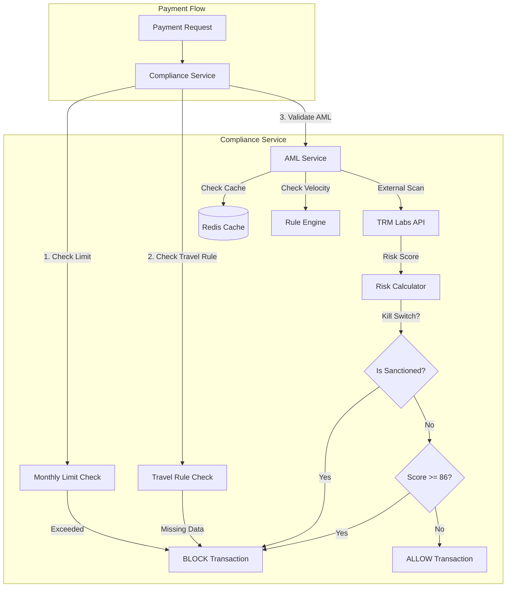

# Compliance Service

## 1. Overview
The **Compliance Service** acts as the regulatory gatekeeper for the platform, ensuring all transactions adhere to AML (Anti-Money Laundering), KYC (Know Your Customer), and Travel Rule regulations. It is responsible for **screening wallets**, **enforcing transaction limits**, and **blocking high-risk activity** in real-time.

**Responsibility**:
- **AML Screening**: Real-time risk scoring of wallet addresses using TRM Labs.
- **Transaction Monitoring**: Enforcing velocity limits and pattern-based rules.
- **Regulatory Enforcement**: Applying Travel Rule checks for transactions > $1,000.
- **KYC Management**: Managing merchant tiers and document verification requirements.

## 2. Architecture & Flow

The service integrates deeply with the payment flow to validate every transaction *before* it is processed.

### Flow Description
1.  **Limit Check**: Verifies if the merchant has sufficient monthly volume remaining.
2.  **Travel Rule**: For amounts > $1,000 USD, ensures required PII (Personally Identifiable Information) is present.
3.  **Velocity Check**: The `RuleEngine` checks if the address has exceeded transaction frequency limits (e.g., "Max 10 txs in 24h").
4.  **AML Screening**: The wallet is screened against global sanctions lists.
5.  **Risk Scoring**: A composite risk score is calculated. If it exceeds the critical threshold, the transaction is blocked immediately.

## 3. Key Components

### Core Interfaces & Structs
-   **`ComplianceService`** (`compliance_impl.go`): The main entry point for all compliance checks.
-   **`AMLService`** (`aml.go`): Handles interactions with TRM Labs and calculates risk scores.
-   **`RuleEngine`** (`rule_engine.go`): Evaluates dynamic rules (velocity, patterns) against transaction context.
-   **`ComplianceAlert`** (`domain/alert.go`): Represents a flagged issue requiring manual review.
-   **`AMLRule`** (`domain/rule.go`): Defines the criteria for blocking or flagging transactions.

### Critical Functions
-   **`ValidatePaymentCompliance()`**: Orchestrates the entire validation pipeline (Limits -> Travel Rule -> AML).
-   **`ValidateTransaction()`**: Performs the specific AML and velocity checks for a wallet address.
-   **`calculateRiskScore()`**: The "Kill Switch" logic that combines external data with internal risk models.
-   **`UpgradeKYCTier()`**: Manages merchant tier upgrades based on verified documentation.

## 4. Critical Business Logic

### 🚨 The "Kill Switch" & Risk Scoring
We use a **Composite Risk Model** to determine if a transaction should be allowed.
Formula: `Score = Max(Direct_Risk, Indirect_Risk) + Metadata_Risk`

| Score Range | Severity | Action |
| :--- | :--- | :--- |
| **>= 86** | **CRITICAL** | **BLOCK** immediately. No manual review. |
| **61 - 85** | **HIGH** | **HOLD** for manual review. Funds are frozen. |
| **<= 60** | **LOW** | **ALLOW**. Log warning if > 20. |

**Kill Switch Triggers**:
-   `IsSanctioned == true`: Immediate Score **100**.
-   Flags: `terrorist-financing`, `child-exploitation`, `ofac`.

### 🛂 KYC Tiers
Merchant limits are strictly enforced based on their verified KYC Tier:

| Tier | Monthly Limit | Requirements |
| :--- | :--- | :--- |
| **Tier 1** | $5,000 | Email + Phone Verification. |
| **Tier 2** | $50,000 | Business Registration Document. |
| **Tier 3** | Unlimited | Business Reg + Tax Cert + Bank Statement. |

### ⚡ Velocity Rules
To prevent automated abuse, the `RuleEngine` enforces dynamic limits:
-   **Example**: "Block if > 10 transactions from same address in 1 hour."
-   These rules are stored in the DB and can be updated without redeploying code.

## 5. Database Schema

The service uses specific tables to track rules, alerts, and compliance data.

### `compliance_alerts`
Stores generated alerts for the Ops team.
| Column | Type | Description |
| :--- | :--- | :--- |
| `id` | UUID | Unique Alert ID. |
| `alert_type` | VARCHAR | `sanctioned_address`, `aml_failure`, etc. |
| `severity` | VARCHAR | `critical`, `high`, `medium`, `low`. |
| `status` | VARCHAR | `open`, `investigating`, `resolved`. |
| `risk_score` | INT | The calculated risk score (0-100). |
| `evidence` | JSONB | Raw data from TRM Labs / Chain analysis. |

### `aml_rules`
Stores dynamic velocity and pattern rules.
| Column | Type | Description |
| :--- | :--- | :--- |
| `id` | VARCHAR | Rule Identifier. |
| `category` | VARCHAR | `velocity`, `pattern`, `wallet`. |
| `conditions` | JSONB | Logic definition (e.g., `{"window": "24h", "max": 10}`). |
| `enabled` | BOOL | Toggle switch for the rule. |

### `travel_rule_data`
Stores PII for high-value transactions.
| Column | Type | Description |
| :--- | :--- | :--- |
| `payment_id` | UUID | Link to the payment. |
| `payer_name` | VARCHAR | Name of the sender. |
| `payer_geo` | VARCHAR | Originating country. |
| `beneficiary_name` | VARCHAR | Name of the recipient. |

## 6. Configuration & Env

| Variable | Description | Example |
| :--- | :--- | :--- |
| `TRM_API_KEY` | API Key for TRM Labs (Blockchain Intelligence). | `trm_live_...` |
| `REDIS_URL` | Connection string for caching screening results. | `redis://localhost:6379` |
| `ENABLE_MOCK_AML` | If `true`, bypasses real TRM calls for testing. | `false` |
| `RISK_SCORE_THRESHOLD` | Score above which txs are auto-blocked. | `86` |
