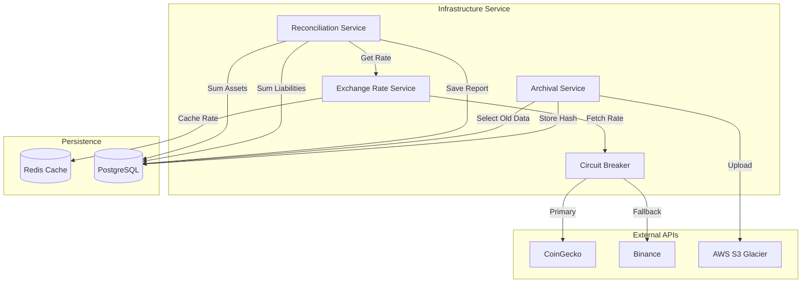

# Infrastructure Service

## 1. Overview
The **Infrastructure Service** provides the foundational "plumbing" for the platform, handling shared, cross-cutting concerns that support all other modules. Its primary responsibilities are **Financial Reconciliation**, **Exchange Rate Management**, **Data Archival**, and **Notification Logging**. It ensures the system remains solvent, data is securely archived, and external dependencies are managed resiliently.

**Responsibility**:
- **Solvency Checks**: Daily verification that Assets >= Liabilities.
- **Oracle Services**: Fetching and caching real-time crypto/fiat exchange rates.
- **Data Lifecycle**: Archiving old records to cold storage (S3 Glacier) for cost optimization.
- **Audit Trails**: Maintaining Merkle tree hashes for data integrity.

## 2. Architecture & Flow

The service operates primarily in the background, supporting active transaction flows.

### Flow Description
1.  **Exchange Rates**: The `ExchangeRateService` uses a **Circuit Breaker** pattern to fetch rates. It tries Primary (CoinGecko) -> Secondary (Binance) -> Tertiary (CryptoCompare) -> Stale Cache.
2.  **Reconciliation**: The `ReconciliationService` runs daily. It calculates `Total Assets` (Crypto + Cash + Fees) and compares them against `Total Liabilities` (Merchant Balances).
3.  **Archival**: Background jobs identify old records (e.g., > 1 year), compress them, upload to S3 Glacier, and replace the DB row with a hash reference.

## 3. Key Components

### Core Interfaces & Structs
-   **`ExchangeRateService`** (`service/exchange_rate.go`): Manages external API connections with retries and failovers.
-   **`ReconciliationService`** (`service/reconciliation.go`): The "Auditor" that proves system solvency.
-   **`CircuitBreaker`** (`service/exchange_rate.go`): Prevents cascading failures when external APIs are down.
-   **`ArchivedRecord`** (`domain/archival.go`): Metadata pointing to offloaded data in S3.
-   **`TransactionHash`** (`domain/archival.go`): Implements a hash chain (Merkle Tree) for immutable audit logs.

### Critical Functions
-   **`PerformDailyReconciliation()`**: The most critical safety check. It ensures we are not bleeding money.
-   **`GetUSDTToVND()`**: Returns the canonical exchange rate used for all conversions.
-   **`InitiateRestore()`**: Triggers the retrieval of cold data from S3 Glacier.

## 4. Critical Business Logic

### ⚖️ Solvency Check (Reconciliation)
The system must always be **Solvent**.
**Formula**: `Assets - Liabilities >= -Tolerance`
-   **Assets**: `Hot Wallet Crypto (VND value) + VND Pool + Fee Revenue + OTC Spread - Expenses`.
-   **Liabilities**: `Sum(Merchant Balances)`.
-   **Status**:
    -   `Balanced`: Difference is within ±1,000 VND (rounding errors).
    -   `Surplus`: Assets > Liabilities (Profit).
    -   `Deficit`: Assets < Liabilities (**CRITICAL ALERT**).

### 🔌 Oracle Circuit Breaker
To ensure 100% uptime for payments, we cannot rely on a single API.
-   **Logic**: If `CoinGecko` fails 5 times in a row, the circuit opens for 60s.
-   **Failover**: Automatically switches to `Binance`.
-   **Last Resort**: If all APIs fail, serves the **Stale Cache** (last known good rate) to keep the system running.

### 🧊 Data Archival & Integrity
-   **Cost Saving**: High-volume tables (e.g., `audit_logs`) are moved to S3 Glacier after X months.
-   **Integrity**: We store the `SHA-256` hash of the archived data in the DB. This proves the data hasn't been tampered with even after moving to cold storage.

## 5. Database Schema

### `reconciliation_logs`
Stores the daily proof of solvency.
| Column | Type | Description |
| :--- | :--- | :--- |
| `id` | UUID | Unique Log ID. |
| `total_assets_vnd` | DECIMAL | Total platform assets. |
| `total_liabilities_vnd` | DECIMAL | Total merchant obligations. |
| `difference_vnd` | DECIMAL | Net position. |
| `status` | VARCHAR | `balanced`, `surplus`, `deficit`. |
| `alert_triggered` | BOOLEAN | True if deficit exceeded tolerance. |

### `archived_records`
Pointers to cold storage data.
| Column | Type | Description |
| :--- | :--- | :--- |
| `original_id` | UUID | ID of the record before archival. |
| `s3_bucket` | VARCHAR | AWS Bucket name. |
| `archive_path` | VARCHAR | Path in S3 (e.g., `2023/10/audit_logs/`). |
| `data_hash` | VARCHAR | SHA-256 hash for verification. |
| `storage_class` | VARCHAR | `GLACIER`, `DEEP_ARCHIVE`. |

### `transaction_hashes`
Merkle tree nodes for auditability.
| Column | Type | Description |
| :--- | :--- | :--- |
| `data_hash` | VARCHAR | Hash of the transaction. |
| `previous_hash` | VARCHAR | Hash of the previous record (Blockchain-like linking). |
| `merkle_root` | VARCHAR | Daily root hash. |

## 6. Configuration & Env

| Variable | Description | Example |
| :--- | :--- | :--- |
| `COINGECKO_API_URL` | Primary rate provider. | `https://api.coingecko.com/api/v3` |
| `BINANCE_API_URL` | Secondary rate provider. | `https://api.binance.com/api/v3` |
| `S3_BUCKET` | Bucket for archival. | `stable-gateway-archives` |
| `S3_REGION` | AWS Region. | `ap-southeast-1` |
| `RECONCILIATION_TOLERANCE` | Allowed rounding error (VND). | `1000` |
