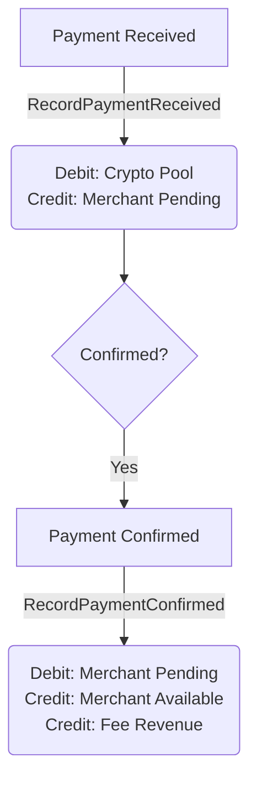
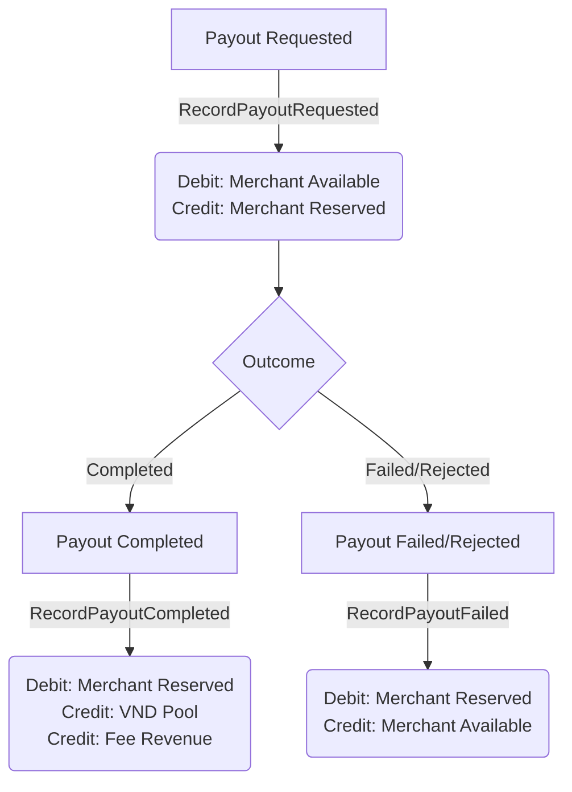
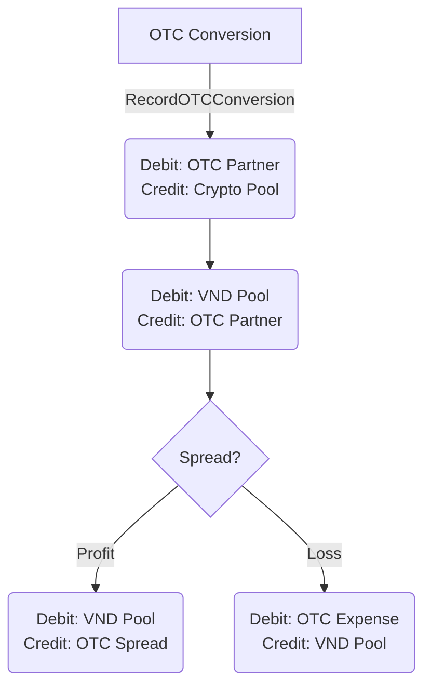

# Ledger Module

## 1. Overview
The Ledger module is the financial core of the Stable Payment Gateway. It is responsible for **managing the double-entry accounting system** for all financial transactions, including payments, payouts, fees, and OTC conversions. It ensures that every movement of funds is tracked, balanced, and immutable, serving as the single source of truth for merchant balances and platform financial health.

## 2. Architecture & Flow

The Ledger module operates on a strict **Double-Entry Accounting** principle where every transaction consists of at least two entries: a debit and a credit.

### Payment Flow

### Payout Flow

### OTC Conversion Flow

## 3. Key Components

### Interfaces & Structs
*   **`LedgerEntry`**: The fundamental unit of the ledger. It represents a single debit or credit entry. It is **immutable** (append-only).
*   **`LedgerEntryPair`**: A helper struct to validate that a pair of entries (debit and credit) are balanced.
*   **`LedgerService`**: The main entry point for business logic. It coordinates database transactions and ensures high-level operations (like "Confirm Payment") translate into correct ledger entries.
*   **`LedgerRepository`**: Handles the persistence of ledger entries and validation of double-entry constraints.
*   **`BalanceRepository`**: Manages the aggregated `merchant_balances` table for fast lookup of merchant funds.

### Critical Functions
*   **`RecordPaymentReceived`**: Locks the crypto amount in the `crypto_pool` and credits the merchant's `pending_balance`.
*   **`RecordPaymentConfirmed`**: Moves funds from `pending_balance` to `available_balance` after deducting fees.
*   **`RecordPayoutRequested`**: Locks funds by moving them from `available_balance` to `reserved_balance` to prevent double-spending during the payout process.
*   **`ValidateLedgerIntegrity`**: A background check that ensures the sum of all debits equals the sum of all credits across the entire system.

## 4. Critical Business Logic (The "Secret Sauce")

### Double-Entry Accounting
Every financial action is recorded as two or more entries. For example, a fee is not just "deducted"; it is **credited** to the `fee_revenue` account and **debited** from the merchant's account. This ensures that money is never created or destroyed, only moved.

### Atomic Locking & Transactions
All ledger operations are executed within **Database Transactions**.
1.  **Create Ledger Entries**: The immutable history is written first.
2.  **Update Balances**: The aggregated `merchant_balances` table is updated.
3.  **Commit**: Both happen or neither happens.

### Merchant Balance Lifecycle
Funds flow through specific states to manage risk:
1.  **Pending**: Funds received but not yet confirmed (e.g., waiting for blockchain confirmations).
2.  **Available**: Funds confirmed and ready for withdrawal.
3.  **Reserved**: Funds locked for a specific purpose (e.g., a payout in progress).

### OTC Spread Handling
When converting Crypto to VND, the system automatically calculates the "Spread" (difference between the market rate and the OTC partner's rate).
*   **Positive Spread**: Recorded as `otc_spread` revenue.
*   **Negative Spread**: Recorded as `otc_expense`.

## 5. Database Schema

### `ledger_entries`
This table is **append-only**.
*   `id`: UUID.
*   `transaction_group`: UUID linking all entries of a single logical transaction.
*   `debit_account`: Name of the account being debited.
*   `credit_account`: Name of the account being credited.
*   `amount`: Decimal amount.
*   `currency`: Currency code (e.g., "USDT", "VND").
*   `reference_type`: Source of the transaction (e.g., "payment", "payout").
*   `reference_id`: ID of the source entity.
*   `entry_type`: "debit" or "credit".

### `merchant_balances`
This table is mutable and serves as a cache for current balances.
*   `merchant_id`: The merchant.
*   `currency`: The currency (e.g., "VND").
*   `pending_balance`: Funds waiting for confirmation.
*   `available_balance`: Funds withdrawable.
*   `reserved_balance`: Funds locked for payouts.

## 6. Configuration & Env

The Ledger module relies on the core database configuration.
*   `DB_HOST`, `DB_PORT`, `DB_USER`, `DB_PASSWORD`, `DB_NAME`: Standard database connection parameters.
*   **Note**: This module does not manage encryption keys directly; it relies on the infrastructure layer for data security.
