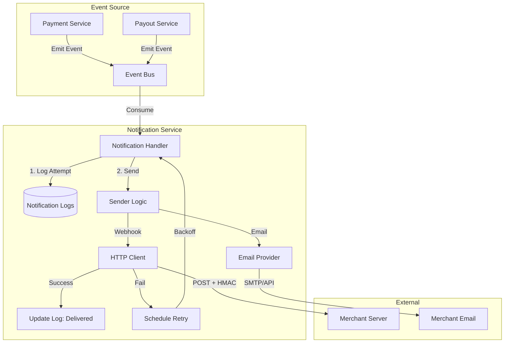

# Notification Service

## 1. Overview
The **Notification Service** is the communication engine of the platform. It is responsible for **delivering real-time updates** to merchants and internal teams via Webhooks and Email. It ensures reliable delivery through retries, exponential backoff, and secure HMAC signing.

**Responsibility**:
- **Webhook Delivery**: Sending HTTP POST requests to merchant endpoints for payment/payout events.
- **Email Notifications**: Sending transactional emails (KYC updates, Payout confirmations).
- **Reliability**: Managing retry queues and tracking delivery status.
- **Security**: Signing webhook payloads to prove authenticity.

## 2. Architecture & Flow

The service uses a "Fire-and-Forget" pattern with built-in resilience.

### Flow Description
1.  **Trigger**: A domain event (e.g., `payment.completed`) is emitted.
2.  **Processing**: The service looks up the merchant's `NotificationPreference`.
3.  **Delivery**:
    *   **Webhook**: Constructs a JSON payload, signs it with the merchant's secret (HMAC-SHA256), and sends it.
    *   **Retry**: If the merchant's server returns 5xx or times out, the service retries up to **5 times** with exponential backoff (1s, 2s, 4s, 8s, 16s).
4.  **Audit**: Every attempt, success, or failure is recorded in `notification_logs`.

## 3. Key Components

### Core Interfaces & Structs
-   **`NotificationService`** (`service/notification_impl.go`): The main logic for sending and retrying notifications.
-   **`NotificationLog`** (`domain/notification.go`): The audit trail for every message sent.
-   **`MerchantNotificationPreference`** (`domain/notification.go`): Configuration for which events a merchant wants to receive and where.
-   **`WebhookPayload`** (`service/notification_impl.go`): The standard JSON structure sent to merchants.

### Critical Functions
-   **`SendWebhook()`**: Handles the HTTP request, HMAC signing, and retry loop.
-   **`generateHMACSignature()`**: Creates the `X-Webhook-Signature` header for security.
-   **`ScheduleRetry()`**: Calculates the next attempt time using exponential backoff.

## 4. Critical Business Logic

### 🔐 Webhook Security (HMAC)
To prevent spoofing, every webhook is signed.
-   **Secret**: A shared secret key known only to the platform and the merchant.
-   **Algorithm**: `HMAC-SHA256(payload, secret)`.
-   **Header**: `X-Webhook-Signature`.
-   **Verification**: Merchants re-compute the hash and compare it to the header to verify the sender.

### 🔄 Reliability & Retries
-   **Max Retries**: 5 attempts.
-   **Backoff Strategy**: Exponential (`2^attempt` seconds).
-   **Idempotency**: Webhooks include a unique `payment_id` or `payout_id` so merchants can handle duplicate deliveries safely.

### 📧 Email Types
-   `payment_confirmation`: "You received 100 USDT".
-   `payout_completed`: "Your withdrawal of 50,000,000 VND is in your bank".
-   `kyc_approved`: "Your account is active. Here is your API Key".

## 5. Database Schema

### `notification_logs`
| Column | Type | Description |
| :--- | :--- | :--- |
| `id` | UUID | Unique Log ID. |
| `merchant_id` | UUID | Recipient. |
| `channel` | VARCHAR | `webhook`, `email`. |
| `event_type` | VARCHAR | `payment.completed`, etc. |
| `status` | VARCHAR | `pending`, `sent`, `failed`, `retrying`. |
| `retry_count` | INT | Current attempt number. |
| `next_retry_at` | TIMESTAMP | When to try again. |

### `merchant_notification_preferences`
| Column | Type | Description |
| :--- | :--- | :--- |
| `merchant_id` | UUID | Owner. |
| `channel` | VARCHAR | Channel being configured. |
| `enabled` | BOOLEAN | Master switch. |
| `subscribed_events` | TEXT[] | List of events to listen for. |

## 6. Configuration & Env

| Variable | Description | Example |
| :--- | :--- | :--- |
| `EMAIL_SENDER` | "From" address. | `no-reply@stablegate.com` |
| `EMAIL_API_KEY` | SendGrid/SES key. | `SG.xxxx...` |
| `HTTP_TIMEOUT` | Webhook timeout. | `30s` |
