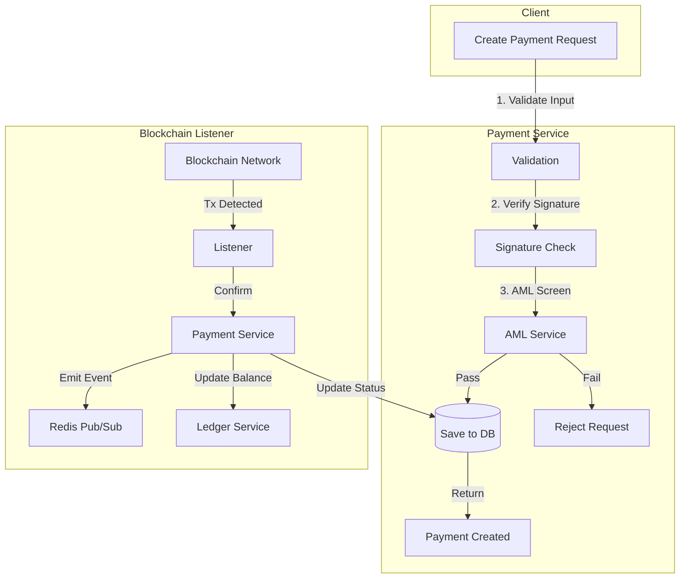

# Payment Service

## 1. Overview
The **Payment Service** is the core engine of the platform, responsible for orchestrating the entire lifecycle of a crypto payment. It handles everything from the initial intent to pay, through security validation (AML/Signature), to final blockchain confirmation and merchant settlement.

**Responsibility**:
- **Lifecycle Management**: Transitions payments through `Created` -> `Pending` -> `Confirming` -> `Completed` states.
- **Security Orchestration**: Enforces "Shift-Left" security (AML & Signatures *before* database writes).
- **Oracle Integration**: Calculates real-time crypto/fiat conversion rates.
- **Event Broadcasting**: Publishes real-time status updates via Redis for WebSocket clients.

## 2. Architecture & Flow

The service uses a secure, multi-stage pipeline to prevent spam and illicit activity from entering the system.

### Flow Description
1.  **Creation (Shift-Left Security)**:
    *   **Signature**: Verifies the user owns the wallet (Ed25519 for Solana).
    *   **AML**: Screens the wallet *before* creating a record. Sanctioned wallets are blocked immediately.
    *   **Persistence**: Only valid, clean requests are saved to the `payments` table.
2.  **Confirmation**:
    *   The Blockchain Module detects the on-chain transaction.
    *   Payment Service verifies the amount (exact match required).
    *   Status updates to `Completed`.
    *   Merchant balance is credited (via Ledger).

## 3. Key Components

### Core Interfaces & Structs
-   **`PaymentService`** (`service/payment_service.go`): The main coordinator.
-   **`Payment`** (`domain/payment.go`): The aggregate root containing amount, status, and audit trails.
-   **`CreatePaymentRequest`** (`port/http.go`): The DTO for new payments, including security proofs (signatures).

### Critical Functions
-   **`CreatePayment()`**: The fortress gate. Implements the 4-step security pipeline.
-   **`ConfirmPayment()`**: Validates on-chain data against the intent. Enforces strict amount matching.
-   **`ExpirePayment()`**: Background job to mark stale payments as `Expired` to release resources.

## 4. Critical Business Logic

### 🛡️ Shift-Left Security
We do not allow bad actors to clutter our database.
1.  **Proof of Ownership**: If `from_address` is provided, a cryptographic signature is **REQUIRED**. This prevents spoofing.
2.  **Pre-Screening**: We call the Compliance Module to check `from_address` against sanctions lists *before* the payment ID is even generated.

### 🤖 State Machine
-   **Created**: Intent registered, waiting for user action.
-   **Pending**: User is interacting (e.g., wallet connected).
-   **Confirming**: Transaction detected on mempool/chain, waiting for block confirmations.
-   **Completed**: Finalized on-chain. Irreversible.
-   **Expired**: Time window (30m) elapsed without payment.
-   **Failed**: Error occurred (e.g., insufficient funds, reverted tx).

### ⚡ Real-Time Updates
-   **Redis Channels**: `payment_events:{payment_id}`
-   **Events**: `payment.confirming`, `payment.completed`, `payment.failed`.
-   **Usage**: The frontend subscribes to these channels to show the "Payment Successful" animation instantly.

## 5. Database Schema

### `payments`
| Column | Type | Description |
| :--- | :--- | :--- |
| `id` | UUID | Unique Payment ID. |
| `merchant_id` | UUID | The recipient. |
| `amount_vnd` | DECIMAL | Fiat value. |
| `amount_crypto` | DECIMAL | Crypto value (USDT). |
| `status` | VARCHAR | Current state. |
| `payment_reference` | VARCHAR | Unique memo/ref for on-chain matching. |
| `tx_hash` | VARCHAR | Blockchain transaction ID. |
| `from_address` | VARCHAR | Sender's wallet. |
| `expires_at` | TIMESTAMP | Deadline for payment. |

## 6. Configuration & Env

| Variable | Description | Example |
| :--- | :--- | :--- |
| `DEFAULT_CHAIN` | Default network. | `solana` |
| `DEFAULT_CURRENCY` | Default token. | `USDT` |
| `FEE_PERCENTAGE` | Platform fee. | `0.01` (1%) |
| `EXPIRY_MINUTES` | Window for payment. | `30` |
| `REDIS_URL` | For real-time events. | `redis://localhost:6379` |
