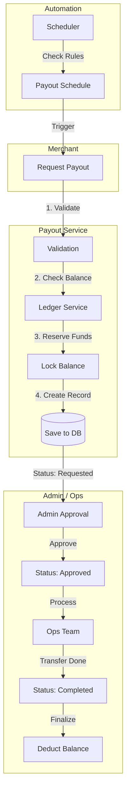

# Payout Service

## 1. Overview
The **Payout Service** manages the off-ramp process, allowing merchants to withdraw their earnings (VND) to their bank accounts. It handles the entire lifecycle of a withdrawal request, from fee calculation and balance reservation to admin approval and final settlement. It also supports **Automated Payouts** based on schedules or balance thresholds.

**Responsibility**:
- **Withdrawal Management**: Processing requests, enforcing limits (Min 1M VND, Max 500M VND).
- **Fee Logic**: Calculating platform fees (0.5%, Min 10k VND).
- **Approval Workflow**: Enforcing the `Requested` -> `Approved` -> `Completed` state machine.
- **Automation**: Triggering auto-withdrawals based on time (Weekly/Monthly) or value (Threshold).

## 2. Architecture & Flow

The service ensures that funds are safely locked before any processing begins.

### Flow Description
1.  **Request**: Merchant requests a withdrawal. System validates limits (1M - 500M VND) and calculates the fee.
2.  **Reservation**: The **Ledger Service** locks the requested amount + fee in the merchant's balance to prevent double-spending.
3.  **Approval**: Admins review the request. If rejected, the lock is released.
4.  **Completion**: Ops team processes the bank transfer and marks the payout as `Completed`. The Ledger then permanently deducts the funds.

## 3. Key Components

### Core Interfaces & Structs
-   **`PayoutService`** (`service/payout_impl.go`): The main business logic handler.
-   **`Payout`** (`domain/payout.go`): The entity representing a withdrawal request.
-   **`PayoutSchedule`** (`domain/schedule.go`): Configuration for automated withdrawals.

### Critical Functions
-   **`RequestPayout()`**: Validates input, calculates fees, and initiates the balance lock.
-   **`ApprovePayout()`**: Admin gatekeeper function.
-   **`CompletePayout()`**: Finalizes the transaction after external bank transfer confirmation.
-   **`CalculateWithdrawalAmount()`**: Determines how much to auto-withdraw based on percentage rules.

## 4. Critical Business Logic

### 💰 Fee Structure
-   **Rate**: 0.5% of the withdrawal amount.
-   **Minimum**: 10,000 VND.
-   **Example**: withdrawing 10,000,000 VND incurs a 50,000 VND fee. Net received: 9,950,000 VND.

### 🤖 Automated Payouts (Smart Off-ramp)
Merchants can configure "Set and Forget" rules:
1.  **Scheduled**: "Withdraw 80% of my balance every Friday at 10 AM".
2.  **Threshold**: "Withdraw 90% whenever my balance exceeds 1,000 USDT".
The system automatically creates payout requests when these conditions are met.

### 🔒 State Machine
-   **Requested**: Initial state. Funds reserved.
-   **Approved**: Admin validated. Ready for banking ops.
-   **Processing**: Ops team is working on the transfer.
-   **Completed**: Money sent. Irreversible.
-   **Rejected**: Admin denied. Funds unlocked.
-   **Failed**: Bank transfer failed. Funds unlocked.

## 5. Database Schema

### `payouts`
| Column | Type | Description |
| :--- | :--- | :--- |
| `id` | UUID | Unique Payout ID. |
| `merchant_id` | UUID | The requester. |
| `amount_vnd` | DECIMAL | Gross amount. |
| `fee_vnd` | DECIMAL | Calculated fee. |
| `net_amount_vnd` | DECIMAL | Amount to transfer. |
| `status` | VARCHAR | Current state. |
| `bank_account_number` | VARCHAR | Destination. |

### `payout_schedules`
| Column | Type | Description |
| :--- | :--- | :--- |
| `merchant_id` | UUID | Owner. |
| `scheduled_frequency` | VARCHAR | `weekly`, `monthly`. |
| `threshold_usdt` | DECIMAL | Trigger value. |
| `scheduled_withdraw_percentage` | INT | % of balance to withdraw. |

## 6. Configuration & Env

| Variable | Description | Example |
| :--- | :--- | :--- |
| `MIN_PAYOUT_VND` | Minimum limit. | `1000000` (1M) |
| `MAX_PAYOUT_VND` | Maximum limit. | `500000000` (500M) |
| `PAYOUT_FEE_PERCENT` | Fee rate. | `0.005` (0.5%) |
