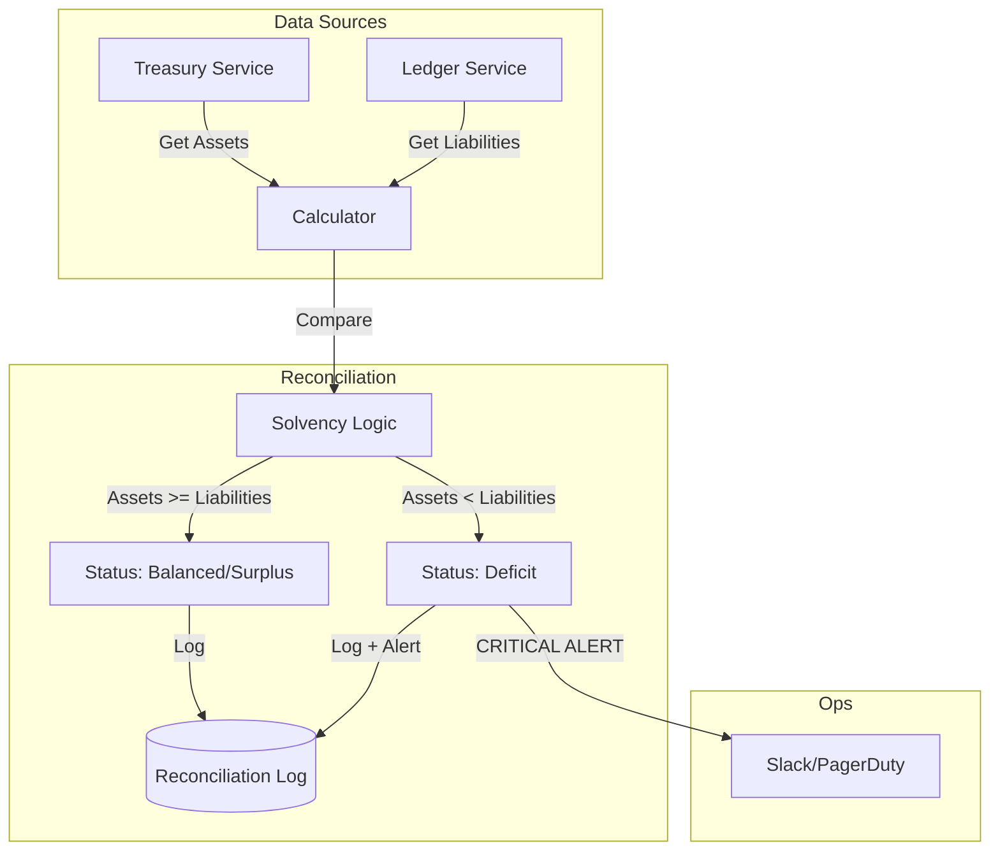

# Reconciliation Service (Domain)

## 1. Overview
The **Reconciliation Service** is the "Financial Auditor" of the platform. It defines the data structures and logic for the **Daily Solvency Check**. Its primary purpose is to mathematically prove that the platform is **Solvent** (Assets >= Liabilities) at any given point in time.

**Responsibility**:
- **Solvency Verification**: Comparing Total Assets (Treasury Wallets + Bank Accounts) against Total Liabilities (Merchant Balances).
- **Audit Logging**: Creating an immutable record of the platform's financial health.
- **Alerting**: Immediately flagging any **Deficit** (Insolvency) to the Ops team.

## 2. Architecture & Flow

This module typically works in conjunction with the **Infrastructure** or **Ledger** services to perform the actual calculations.

### Flow Description
1.  **Snapshot**: At a scheduled time (e.g., midnight), the system freezes the state.
2.  **Aggregation**:
    *   **Assets**: Sum of all Crypto in Treasury Wallets + Fiat in Bank Accounts.
    *   **Liabilities**: Sum of all Merchant `Available` + `Pending` balances.
3.  **Comparison**: `Difference = Assets - Liabilities`.
4.  **Result**:
    *   **Surplus**: We have more money than we owe (likely due to accumulated fees).
    *   **Deficit**: We owe more than we have (Potential hack or bug). **Trigger Alert**.

## 3. Key Components

### Core Interfaces & Structs
-   **`ReconciliationLog`** (`domain/reconciliation.go`): The snapshot record containing the financial totals and status.

### Critical Functions
-   **`IsSolvent()`**: Returns `true` if the system is healthy (`Balanced` or `Surplus`).
-   **`IsDeficit()`**: Returns `true` if the system is insolvent.
-   **`GetDeficitAmount()`**: Calculates the exact shortfall amount for investigation.

## 4. Critical Business Logic

### ⚖️ The Solvency Equation
The fundamental rule of the platform is:
`Total Assets (Crypto + Fiat) >= Total Liabilities (Merchant Balances)`

### 🚨 Status Definitions
-   **Balanced**: `Difference == 0` (Perfect match).
-   **Surplus**: `Difference > 0` (Healthy, represents uncollected fees/profits).
-   **Deficit**: `Difference < 0` (Critical failure, requires immediate shutdown/investigation).

## 5. Database Schema

### `reconciliation_logs`
| Column | Type | Description |
| :--- | :--- | :--- |
| `id` | UUID | Unique Log ID. |
| `total_assets_vnd` | DECIMAL | Sum of all holdings. |
| `total_liabilities_vnd` | DECIMAL | Sum of all debts. |
| `difference_vnd` | DECIMAL | Net position. |
| `status` | VARCHAR | `balanced`, `surplus`, `deficit`. |
| `alert_triggered` | BOOLEAN | Was Ops notified? |

## 6. Configuration & Env

| Variable | Description | Example |
| :--- | :--- | :--- |
| `RECONCILIATION_CRON` | Schedule time. | `0 0 * * *` (Midnight) |
| `TOLERANCE_THRESHOLD` | Ignorable rounding error. | `1000` (VND) |
