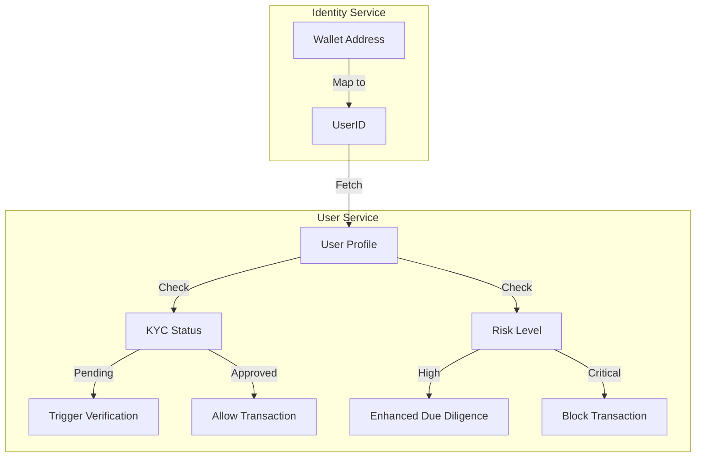

# User Service (Domain)

## 1. Overview
The **User Service** represents the **Identity Source of Truth** for the platform. Unlike the "Merchant" (who receives funds), the "User" represents the **Payer** (the person behind the wallet). This module is critical for **KYC (Know Your Customer)** and **AML (Anti-Money Laundering)** compliance, ensuring we know who is sending money through the gateway.

**Responsibility**:
- **Identity Management**: Storing verified PII (Personally Identifiable Information).
- **KYC State**: Tracking the status of document verification and liveness checks.
- **Risk Profiling**: Categorizing users by risk level (Low to Critical) based on their activity and background.
- **Compliance**: Flagging PEPs (Politically Exposed Persons) and Sanctioned individuals.

## 2. Architecture & Flow

This module works closely with the **Identity Service** to link anonymous wallet addresses to real-world identities.

### Flow Description
1.  **Discovery**: When a wallet interacts with the gateway, the Identity Service resolves it to a `User`.
2.  **Verification**: If the user is new or unverified, they are prompted to complete KYC (e.g., via Sumsub).
3.  **Assessment**: The User Service stores the results (`FaceLivenessPassed`, `DocumentType`) and assigns a `RiskLevel`.
4.  **Enforcement**: Payments are allowed or blocked based on `CanMakePayment()`.

## 3. Key Components

### Core Interfaces & Structs
-   **`User`** (`domain/user.go`): The aggregate root containing PII, KYC status, and risk flags.
-   **`RiskLevel`**: Enum (`low`, `medium`, `high`, `critical`).
-   **`DocumentType`**: Enum (`passport`, `national_id`, etc.).

### Critical Functions
-   **`IsKYCVerified()`**: Returns `true` only if status is Approved **AND** Liveness check passed.
-   **`NeedsEnhancedDueDiligence()`**: Returns `true` if the user is a PEP, Sanctioned, or High Risk.
-   **`CanMakePayment()`**: The ultimate gatekeeper function.

## 4. Critical Business Logic

### 🆔 Smart Identity
A single `User` can be linked to multiple wallet addresses (handled by the Identity module). This allows us to build a holistic view of a user's behavior across different chains and wallets.

### 🛡️ Risk Scoring
Users are assigned a risk level that dictates their transaction limits and monitoring strictness:
-   **Low**: Standard limits.
-   **Medium**: Lower limits, occasional manual review.
-   **High**: Very low limits, mandatory manual review (EDD).
-   **Critical**: Account frozen.

### 🕵️ PEP & Sanctions
-   **PEP (Politically Exposed Person)**: Someone with a prominent public function. Requires extra scrutiny.
-   **Sanctioned**: Someone on a government blocklist (OFAC, UN). **Zero tolerance** (blocked immediately).

## 5. Database Schema

### `users`
| Column | Type | Description |
| :--- | :--- | :--- |
| `id` | UUID | Unique User ID. |
| `full_name` | VARCHAR | Legal name from ID. |
| `kyc_status` | VARCHAR | `pending`, `approved`, `rejected`. |
| `risk_level` | VARCHAR | Risk classification. |
| `is_pep` | BOOLEAN | PEP flag. |
| `is_sanctioned` | BOOLEAN | Sanction flag. |
| `face_liveness_passed` | BOOLEAN | Anti-spoofing check. |

## 6. Configuration & Env

| Variable | Description | Example |
| :--- | :--- | :--- |
| `KYC_PROVIDER` | Vendor for ID verification. | `sumsub` |
| `RISK_THRESHOLD_HIGH` | Score to trigger High risk. | `80` |
