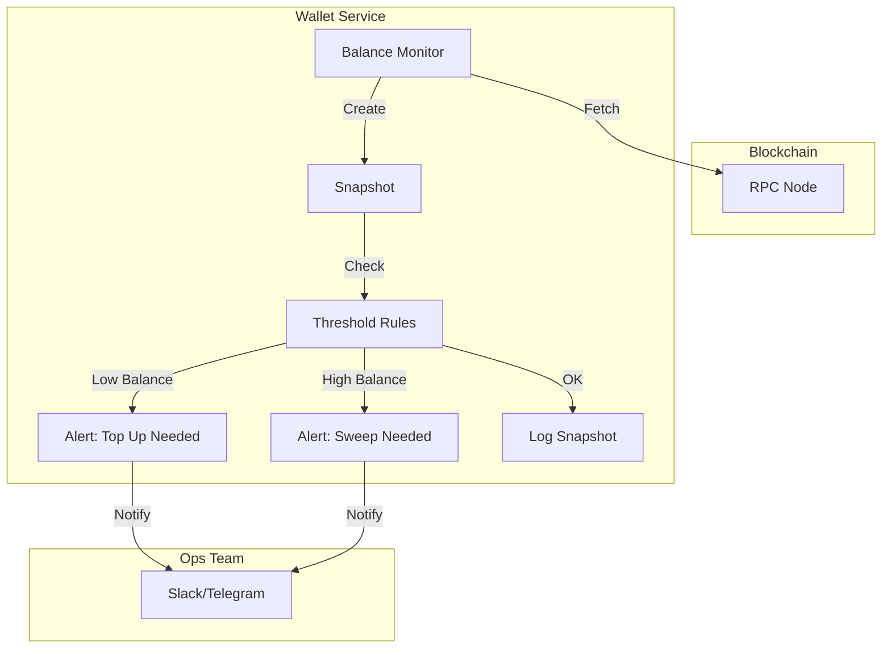

# Wallet Service (Domain)

## 1. Overview
The **Wallet Service** is the **Observability Layer** for the platform's on-chain infrastructure. While the Treasury Service manages the *movement* of funds, the Wallet Service is responsible for **monitoring** the health, balances, and gas levels of our operational (Hot) wallets. It ensures we never run out of gas for transactions or hold too much risk in a single address.

**Responsibility**:
- **Balance Snapshots**: Recording the exact state of wallets (Native Token + Stablecoins) at regular intervals.
- **Health Monitoring**: Tracking Gas (SOL/ETH) levels to prevent stuck transactions.
- **Alerting**: Triggering notifications when balances breach safety thresholds (Low Gas or High Risk).
- **Audit Trail**: Providing a historical view of wallet balances for reconciliation.

## 2. Architecture & Flow

This module typically runs as a background cron job or is triggered by the Blockchain Listener.

### Flow Description
1.  **Poll**: The system queries the blockchain for the current balance of defined hot wallets.
2.  **Snapshot**: A `WalletBalanceSnapshot` record is created, capturing Native (Gas) and Token (USDT/USDC) balances.
3.  **Evaluate**:
    *   **Low Gas**: If `NativeBalance < MinThreshold`, alert Ops to top up gas.
    *   **High Risk**: If `TotalUSDValue > MaxThreshold`, alert Treasury to sweep funds.
4.  **Persist**: The snapshot is saved to the DB for historical graphing and audit.

## 3. Key Components

### Core Interfaces & Structs
-   **`WalletBalanceSnapshot`** (`domain/balance.go`): A point-in-time record of a wallet's assets.
-   **`Network`**: Enum (`mainnet`, `testnet`, `devnet`).

### Critical Functions
-   **`ShouldAlert()`**: Returns `true` if the wallet is in a critical state (Empty or Overflowing).
-   **`GetAlertMessage()`**: Generates human-readable warnings for the Ops team.
-   **`GetAlertDetails()`**: Returns a structured map of balances for the notification payload.

## 4. Critical Business Logic

### ⛽ Gas Management
Operational wallets must always have enough native tokens (SOL, ETH, BNB) to pay for transaction fees.
-   **Logic**: `If NativeBalance < SafeGasLimit THEN Alert("Low Gas")`

### 🛡️ Risk Thresholds
To minimize loss in the event of a key compromise, hot wallets should not hold excessive funds.
-   **Logic**: `If TotalUSDValue > SafetyCap THEN Alert("Sweep Required")`

### 📊 Multi-Asset Tracking
A single snapshot tracks multiple assets simultaneously:
-   **Native**: For gas fees.
-   **USDT/USDC**: For payment liquidity.
-   **Total USD**: Aggregate value for risk assessment.

## 5. Database Schema

### `wallet_balance_snapshots`
| Column | Type | Description |
| :--- | :--- | :--- |
| `id` | UUID | Unique Snapshot ID. |
| `wallet_address` | VARCHAR | The monitored address. |
| `chain` | VARCHAR | `solana`, `bsc`. |
| `native_balance` | DECIMAL | Gas token amount. |
| `usdt_balance` | DECIMAL | Stablecoin amount. |
| `is_below_min_threshold` | BOOLEAN | Alert flag. |
| `snapshot_at` | TIMESTAMP | Time of record. |

## 6. Configuration & Env

| Variable | Description | Example |
| :--- | :--- | :--- |
| `MIN_GAS_THRESHOLD` | Minimum SOL/ETH to keep. | `1.0` |
| `MAX_HOT_WALLET_USD` | Max value before alert. | `10000` ($10k) |
